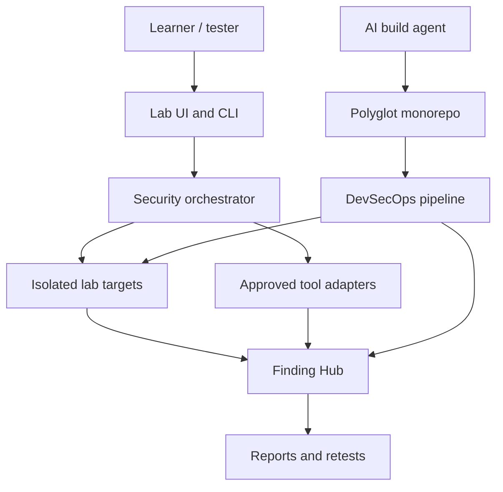

# OWASP & PenTest Security Lab — Agent Build Specification

Version: 1.0.0  
Status: implementation-ready  
Audience: AI coding agents, security engineers, developers, QA engineers and learners  
Execution boundary: local or explicitly authorized isolated environments only

## Purpose

This package specifies a polyglot security-learning platform that teaches Web,
API, Mobile and infrastructure penetration testing through a closed learning
loop:

1. Build an intentionally vulnerable scenario in an isolated lab.
2. Detect it manually and with approved automation.
3. Demonstrate minimum, non-destructive impact using synthetic data.
4. Identify the root cause and map it to OWASP, CWE and verification controls.
5. Implement the secure counterpart.
6. Add regression tests and a CI/CD security gate.
7. Produce evidence, remediation guidance and a retest report.

The repository to be built from this specification is a portfolio-quality
training system, not a general-purpose attack platform.

## Required applications

| Application | Primary stack | Responsibility |
| --- | --- | --- |
| Web Lab Insecure | React + TypeScript + NestJS | Isolated Web vulnerability scenarios |
| Web Lab Secure | React + TypeScript + NestJS | Correct implementations and regression baseline |
| Java API Lab | Java + Spring Boot + PostgreSQL | REST/GraphQL authorization and business-flow scenarios |
| Mobile Security Lab | React Native bare + Kotlin + Swift | Android/iOS MASVS scenarios in distinct lab targets |
| Security Orchestrator | Python | Scope validation, safe tool execution and run control |
| Finding Hub | Python service + PostgreSQL | Finding normalization, triage, evidence and risk workflow |
| Report Generator | TypeScript | Executive, technical and retest reports |
| Delivery Platform | GitHub Actions + Docker + Terraform | Testing, scanning, SBOM, signing and release evidence |

## Non-negotiable constraints

- Never scan or attack a target that is absent from the active signed scope.
- Bind vulnerable applications to loopback or a private host-only network.
- Insecure applications and secure applications are separate deployable units.
- Vulnerable artifacts cannot be release-signed or published to a public registry.
- Use synthetic identities, credentials, tokens, records and canary files only.
- Do not implement destructive payloads, uncontrolled denial of service, stealth,
  persistence outside the lab or collection of real credentials.
- Every scanner adapter must support allowlisting, rate limits, timeout,
  concurrency limits, dry-run, kill switch and immutable audit logging.
- Apply TDD. Application code must maintain at least 95% line, statement,
  function and branch coverage unless an approved exception names the exact
  generated or platform-owned code.
- A vulnerability scenario is incomplete until the secure fix, regression test,
  finding documentation and retest evidence exist.
- Use exact dependency versions and lockfiles. Updates are reviewed and tested.

## Recommended implementation order

1. Read [vision and goals](docs/00-overview/01-vision-goals.md),
   [scope](docs/00-overview/02-scope-non-goals.md) and
   [rules of engagement](docs/04-security/02-rules-of-engagement.md).
2. Read the [system architecture](docs/02-architecture/01-system-context.md) and
   all accepted [architecture decisions](adrs/000-index.md).
3. Follow the [agent operating manual](docs/08-agent/01-operating-manual.md).
4. Execute the [implementation phases](docs/08-agent/02-implementation-phases.md)
   in order and consume tasks from the [backlog](docs/08-agent/03-task-backlog.md).
5. Apply the [Definition of Done](docs/08-agent/04-definition-of-done.md) to every
   task and milestone.

## Architecture at a glance

## Build outputs

The implementing agent must deliver:

- Reproducible local bootstrap with one documented command.
- Separate insecure and secure Web applications.
- A Java API with documented REST and GraphQL contracts.
- Distinct Android/iOS insecure and secure application identifiers.
- Scope-guarded Python orchestration and scanner adapters.
- Finding lifecycle, evidence store and report generation.
- GitHub Actions workflows for PR, main, nightly and release.
- CycloneDX or SPDX SBOMs, artifact hashes, signatures and provenance.
- Threat model, ADRs, runbooks and a full controlled capstone engagement.

## Documentation map

The complete reading order and ownership map is in
[Document map](docs/00-overview/05-document-map.md). Templates are under
[`templates/`](templates/), and architectural decisions are under
[`adrs/`](adrs/).

## Source standards

The specification is based on OWASP Top 10:2025, OWASP ASVS 5.0, OWASP WSTG,
OWASP API Security Top 10:2023, OWASP MASVS/MASTG/MASWE, NIST SP 800-115,
NIST SSDF 1.1, CWE, CVSS v4.0, EPSS and the CompTIA PenTest+ PT0-003 objectives.
Canonical links and versioning rules are listed in
[Standards and glossary](docs/00-overview/03-standards-glossary.md).

