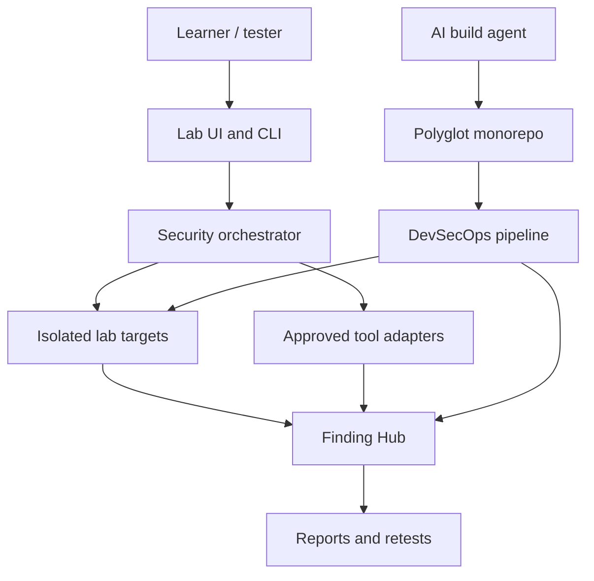

# OWASP & PenTest Security Lab — Agent Build Specification

Version: 1.0.0
Status: implementation-ready; Phase 0 built, Phase 1 started
Audience: AI coding agents, security engineers, developers, QA engineers and learners
Execution boundary: local or explicitly authorized isolated environments only
Bootstrap: `node tools/repo.mjs check:all`

---

## Contents

- [Purpose](#purpose)
- [What exists today](#what-exists-today)
- [Quick start](#quick-start)
- [The repository task interface](#the-repository-task-interface)
- [Repository layout](#repository-layout)
- [Design principles](#design-principles)
- [Contracts](#contracts)
- [Toolchain and version policy](#toolchain-and-version-policy)
- [Required applications](#required-applications)
- [Non-negotiable constraints](#non-negotiable-constraints)
- [Architecture at a glance](#architecture-at-a-glance)
- [Implementation order](#implementation-order)
- [Testing and the quality bar](#testing-and-the-quality-bar)
- [Architecture decisions](#architecture-decisions)
- [Open decisions that need a human](#open-decisions-that-need-a-human)
- [Working in this repository](#working-in-this-repository)
- [Documentation map](#documentation-map)
- [Source standards](#source-standards)

---

## Purpose

This package specifies a polyglot security-learning platform that teaches Web,
API, Mobile and infrastructure penetration testing through a closed learning
loop:

1. Build an intentionally vulnerable scenario in an isolated lab.
2. Detect it manually and with approved automation.
3. Demonstrate minimum, non-destructive impact using synthetic data.
4. Identify the root cause and map it to OWASP, CWE and verification controls.
5. Implement the secure counterpart.
6. Add regression tests and a CI/CD security gate.
7. Produce evidence, remediation guidance and a retest report.

The repository built from this specification is a portfolio-quality training
system, not a general-purpose attack platform. Every capability that could be
turned outward — scanning, adapter execution, artifact publication — is
constrained by a contract before it is constrained by a policy document.

## What exists today

The repository is a **specification package with a working Phase 0 foundation
and the first Phase 1 module implemented**. The specification is complete; most
runtime services are not yet built.

| | Count |
| --- | --- |
| Markdown documents | 109 (68 under `docs/`) |
| Architecture decision records | 11 accepted and 2 proposed, plus an index |
| Reusable templates | 8 |
| JSON Schema contracts | 14 |
| Verification modules (`tools/`) | 9 |
| Repository checks | 9 |
| Foundation test suites | 22 |
| Tests | 317 Node, 176 Python, all passing |

### Built and verified

| Backlog task | Status |
| --- | --- |
| E0-001 Polyglot monorepo and repository task interface | complete |
| E0-002 Version manifest, exact lockfiles, prerequisite verifier | complete |
| E0-003 Documentation and contract validation jobs | complete |
| E0-004 Scope JSON Schema and safe sample scopes | complete |
| E0-005 Private Compose topology and exposure assertion | complete |
| E0-006 Architecture dependency fitness tests | complete |
| E0-007 Base PR workflow with minimal permissions | workflow built; gate stages blocked |

### The first cross-language module

**E1-001, the special-range address policy, is implemented in Python** at
`services/orchestrator/scope/address_policy.py` and runs on every `check:all`.

This is the design's central claim being paid off. The JSON Schema in the scope
contract decides what an operator may *write down*; the Python module decides
what the runtime does with a destination that arrives another way, through DNS
resolution or a redirect. Both are tested against the **same 75 conformance
vectors**, so a disagreement between the two languages is a test failure rather
than a production surprise.

Building the second implementation immediately found two divergences the vectors
had not yet pinned; both are now vectors of their own. See
[`packages/contracts/security/README.md`](packages/contracts/security/README.md).

### Prepared ahead of their runtime

The language-neutral half is built and verified, so the implementation has
something to be tested against rather than a paragraph to interpret.

| Backlog task | What is built | What remains |
| --- | --- | --- |
| E1-001 Special-range address policy | 77 vectors, the Python classifier and a 690-input differential suite | complete |
| E1-002 DNS resolution and pinning | resolver-injected pinning, redirect revalidation | proxy CONNECT targets |
| E1-003 Immutable scope snapshot and digest | canonical form, 17 vectors, digest tool | signing, approval and storage |
| E1-004 Execution grants and replay protection | contract, verifier, replay cache, differential suite, ADR-012 | ADR-012 acceptance; audit wiring |
| E1-005 Run plane | **complete** — audit chain, fail-closed recording, idempotency, run state machine, budgets charged on issue | wiring budgets to adapter invocation (E1-007) |
| E1-006 Global kill and heartbeat | kill switch that refuses rather than returning a boolean, heartbeat with derived bounds | wiring the sweep to run cancellation |
| E1-010 Canonical finding model | occurrence, finding and lifecycle contracts | ingestion, fingerprinting, workflow engine |
| E1-013 Domain event contracts | envelope, catalog of 14 events | outbox, relay, delivery records, poison queue |

### Still unselected

`node tools/repo.mjs check:prerequisites` reports what is satisfied and what is
deferred. Java and a Java build tool are absent and gate epic E3. `git` is not
installed, so publication goes through the Git Data API.

Four container image digests remain unselected: `nodeImage`, `pythonImage`,
`javaImage` and `postgresql`. Each waits on a choice that belongs to another
task — which base image the Console ships on, which Java LTS, which PostgreSQL
the topology runs. Until they are pinned, `check:exposure` reports them as
*deferred with a blocking task*, never as a pass.

The three GitHub Action pins are resolved — `actions/checkout` at `v7.0.1`,
`actions/setup-node` and `actions/setup-python` at `v7.0.0` — each recorded as
the 40-character commit its release tag resolves to, read from the action
repository rather than transcribed from a tag.

## Quick start

Requirements: Node.js 24.18.1, npm 11.16.0 and Python 3.12.10 (see
[`version-manifest.json`](version-manifest.json)). No third-party packages are
installed and none are needed — both the Node tooling and the Python
orchestrator are standard library only.

```bash
node tools/repo.mjs check:all
```

That is the single documented bootstrap command. It runs every check in
dependency order and stops at the first failure. Expected output ends with:

```
All 9 checks passed.
```

To see what is available:

```bash
node tools/repo.mjs help
```

Exit codes are stable and meaningful: **0** success, **1** the task failed,
**2** the invocation was invalid (unknown task, missing task, extra arguments).
A task never exits 0 with an empty or unread result.

## The repository task interface

Every verification is a task on one entry point, `tools/repo.mjs`. There is no
hidden script, no Makefile and no shell wrapper — the secure-coding standard in
[`04-security/03-secure-coding-standard.md`](docs/04-security/03-secure-coding-standard.md)
prohibits shell execution, so every child process is spawned with an argument
vector.

| Task | What it enforces |
| --- | --- |
| `help` | Lists every task with its phase and description. |
| `check:foundation` | Runs the foundation acceptance suite: module boundaries, the physical separation of the insecure and secure Web targets, the task interface contract, and the fail-closed behavior of the checks themselves. |
| `check:prerequisites` | Probes local toolchains against `version-manifest.json`. A tool required by the active phase may not be unselected. Probes are bounded by a timeout and an output limit, and a timeout is a distinct outcome from a failure. Local only — see below. |
| `check:docs` | Validates every relative link, every fenced code block and the ADR index against the ADR files on disk. |
| `check:contracts` | Compiles every JSON Schema and validates every sample document against it. A sample that has drifted from its contract fails here, before any test runs. |
| `check:architecture` | Enforces the dependency direction from [ADR-001](adrs/001-polyglot-monorepo.md) and the ownership of process execution: domain code may not import infrastructure, and only the orchestrator may spawn a process. |
| `check:exposure` | Asserts the generated lab topology binds no target to a host-reachable address, grants no privileged mode and declares no host network. Unpinned images are reported as deferred, not passed. |
| `check:workflows` | Enforces minimal workflow permissions, action pinning by commit SHA, the absence of `pull_request_target`, and that every workflow file on disk is byte-identical to what its descriptor renders. |
| `check:orchestrator` | Runs the Python orchestrator suite against the same conformance vectors the Node suite uses. A missing interpreter fails the check; it is never skipped. |
| `check:mutation` | Applies each catalogued defect to a copy of the orchestrator and requires the suite to fail. A surviving mutant names the safety property that is no longer guaranteed. |
| `check:all` | Runs all nine in bootstrap order and stops at the first failure. |

`check:all` is verified by running it rather than by a test: it invokes
`check:foundation`, so a test that executed it would recurse into the suite that
contains the test. Its parts are covered individually.

**`check:prerequisites` does not run in CI**, and the first run of the pull
request workflow is why. The manifest pins `containerRuntime` to the version on
the developer's workstation; a GitHub-hosted runner carried a different one and
the check failed on a difference that changes nothing about the build. The
verifier describes a development machine, not a runner. What CI actually needs
from the manifest — that no phase-0 entry is left unselected, and that the
workflow's `node-version` equals the pinned Node — is asserted by the foundation
suite and by `check:workflows`, both of which do run there. The underlying
policy gap is entry 17 of the
[conflict register](docs/08-agent/08-specification-conflicts.md).

### One defect this interface already caught

`check:foundation` originally reported success while its own tests failed. A
nested `node --test` that inherits `NODE_TEST_CONTEXT` skips every file and
still exits 0, so any invocation from inside a Node test context produced a
green result that had run nothing. `tools/repo.mjs` now clears
`NODE_TEST_CONTEXT` and `NODE_TEST_WORKER_ID` before spawning the runner, and
two regression tests cover it. This is the "scanner reports zero issues but its
output is missing" case from
[`04-definition-of-done.md`](docs/08-agent/04-definition-of-done.md), and it is
why every check here distinguishes *pending* from *passed*.

## Repository layout

```
.
├── README.md                     Normative entrypoint (this file)
├── README.pt-BR.md               Portuguese executive entrypoint
├── MANIFEST.md                   Package manifest and completeness checklist
├── package.json                  Private root manifest, exact engines
├── version-manifest.json         Pinned versions and explicitly unselected entries
│
├── .github/
│   ├── workflow-set.json         Descriptor the workflow files are rendered from
│   └── workflows/pr.yml          Generated; check:workflows fails if hand-edited
│
├── docs/                         The specification — 68 documents
│   ├── 00-overview/              Vision, scope, standards, roadmap, document map
│   ├── 01-product/               PRD, personas, requirements, acceptance, traceability
│   ├── 02-architecture/          Context, containers, boundaries, runtime, data
│   ├── 03-applications/          Per-application implementation specifications
│   ├── 04-security/              Threat model, Rules of Engagement, test catalogs
│   ├── 05-devsecops/             Pipelines, gates, scanners, SBOM, release
│   ├── 06-testing/               TDD, coverage, mutation, E2E, resilience
│   ├── 07-data-api/              Domain model, schema, APIs, events, SARIF mapping
│   ├── 08-agent/                 Operating manual, phases, backlog, DoD,
│   │                             implementation log, conflict register
│   └── 09-operations/            Local, scan, incident, backup, maintenance runbooks
│
├── adrs/                         11 accepted decisions and an index
├── templates/                    Finding, report, threat, test, risk, ADR, runbook, PR
│
├── tools/                        Verification modules — zero dependencies
│   ├── repo.mjs                  Task interface and exit-code contract
│   ├── schema.mjs                Fail-closed JSON Schema subset validator
│   ├── prerequisites.mjs         Bounded toolchain probes
│   ├── docs-check.mjs            Links, fences, ADR index
│   ├── contracts-check.mjs       Schema compilation and sample validation
│   ├── architecture-check.mjs    Dependency direction and execution ownership
│   ├── topology.mjs              Lab topology descriptor → Compose renderer
│   ├── workflows.mjs             Workflow descriptor → GitHub Actions renderer
│   └── scope-hash.mjs            Canonical serialization and scope digest
│
├── packages/
│   ├── contracts/                Language-neutral contracts and conformance vectors
│   │   ├── security/             Scope record, address policy, canonical form
│   │   ├── findings/             Occurrence, finding, lifecycle
│   │   ├── events/               Event envelope and catalog
│   │   ├── infra/                Lab topology
│   │   └── ci/                   Workflow set
│   └── ts-domain/                Shared TypeScript primitives (boundary only)
│
├── apps/
│   ├── console-web/              Lab Console (React + TypeScript)
│   ├── web-lab-insecure/         Vulnerable Web target
│   ├── web-lab-secure/           Secure counterpart — a separate deployable unit
│   ├── api-java-lab/             Java + Spring Boot API target
│   └── mobile-lab/               Android/iOS lab targets
│
├── services/
│   ├── orchestrator/             Scope Guard, run control, guarded adapters
│   ├── finding-hub/              Ingestion, deduplication, workflow, evidence
│   └── report-generator/         Executive, technical and retest reports
│
├── security/
│   ├── rules/                    Scan rule packs
│   └── profiles/                 Versioned scan profiles
│
├── infra/
│   ├── compose/                  Generated private lab topology
│   └── terraform/                Optional infrastructure definitions
│
└── tests/
    ├── foundation/               22 acceptance suites, 317 tests
    └── capstone/                 End-to-end engagement assertions
```

Every module directory carries a README stating its purpose, its authoritative
specification and its boundary rules from
[`03-monorepo-module-boundaries.md`](docs/02-architecture/03-monorepo-module-boundaries.md).
`check:architecture` enforces those boundaries; they are not advisory.

## Design principles

These are the rules the tooling actually implements. They are worth reading
before adding anything, because they explain why several contracts look
narrower than they need to be.

### Fail closed — a missing result is never a pass

Every check distinguishes three outcomes: **passed**, **failed** and **deferred
with a blocking task**. Nothing is allowed to be silently absent. An unpinned
image is deferred and names the backlog task that must pin it; it never reads as
an exposure check that found nothing wrong. A schema keyword the validator has
not implemented raises an error rather than being skipped, so a contract cannot
appear to be enforced by a rule that was quietly ignored.

### Make the unsafe state inexpressible, not merely rejected

Wherever possible a safety rule is encoded as *structure* rather than as a
validation that could be removed. The following have no representation at all in
their contracts, so no reviewer has to notice their absence:

- a wildcard bind address or a host-network target in the lab topology;
- privileged mode, added capabilities or a host path mount;
- `pull_request_target`, a write permission that was not requested, or an action
  referenced by tag instead of commit SHA;
- a destructive scan profile;
- an event payload field carrying free text or bytes — the payload type
  vocabulary has only identifier, timestamp, integer, boolean, enum value,
  digest and label, so an event that wanted to carry a request body, a cookie or
  a token cannot express it.

### Generate, do not parse

The Compose topology ([ADR-009](adrs/009-generated-lab-topology.md)) and the CI
workflows ([ADR-010](adrs/010-generated-ci-workflows.md)) are **rendered from
validated JSON descriptors**. The check then asserts the file on disk is
byte-identical to what the descriptor renders. Hand-editing a workflow is
detected as a difference rather than analysed as YAML, which removes a whole
class of "the linter did not understand this construct" failures.

### Canonical serialization for cross-language agreement

The scope digest ([ADR-011](adrs/011-canonical-scope-serialization.md)) must
produce the same bytes in a TypeScript console and a Python orchestrator. Two
hazards were removed by restriction rather than by convention: object keys are
limited to `[A-Za-z0-9_.-]` because JavaScript sorts by UTF-16 code unit and
Python by code point (they disagree above the basic multilingual plane), and
unpaired surrogates are refused outright because they have no UTF-8 encoding.
Non-ASCII text is emitted literally, so a Python implementation must serialize
with `ensure_ascii=False`. Neither hazard would have failed loudly; both would
have produced a digest that is merely *different*, and a scope whose digest does
not verify reads as tampering.

### One aggregate type, one producer

`aggregate_version` is the only ordering the transactional outbox guarantees,
and a consumer that sees a gap rebuilds from the source API. That contract is
written for a single writer, so exactly one producer writes each aggregate type
and an event type is named for the aggregate it versions. Two writers would
either collide on a version or open gaps that are not losses.

### Zero third-party dependencies in the verification path

`tools/` uses only the Node standard library, including a purpose-built JSON
Schema subset validator. A supply-chain lab that pulled an unpinned validator to
check its own supply-chain rules would be self-refuting.

## Contracts

Contracts live under [`packages/contracts/`](packages/contracts/) and are
language-neutral on purpose: a Python service and a TypeScript console are both
held to them. Every schema has samples, and `check:contracts` validates the
samples before any test runs.

| Contract | Enforces |
| --- | --- |
| `security/scope-record.schema.json` | The signed scope a run is authorized against, with two worked samples (loopback and private network) carrying real digests. |
| `security/address-policy.schema.json` | Special-range address handling: 68 conformance vectors over IPv4, IPv6, hostnames and URLs, covering public, loopback, link-local, metadata, carrier NAT, documentation, benchmarking and reserved ranges, plus the alternate spellings — zero-padded octets, decimal and hexadecimal forms, and IPv4-mapped IPv6. |
| `security/canonical-form.schema.json` | The canonical serialization the scope digest is computed over: 10 accepted and 7 rejected vectors, so a second implementation is held to the same rules. |
| `findings/occurrence.schema.json` | What a tool observed, including `source_severity`. |
| `findings/finding.schema.json` | Identity, state and human decisions. It has **no `severity` field at all**, and a test asserts its absence — collapsing a tool signal into a risk decision is what [`07-vulnerability-management.md`](docs/04-security/07-vulnerability-management.md) forbids. Priority lives here with a rationale and a named decider. |
| `findings/finding-lifecycle.schema.json` | Nine states and twelve transitions. Tests assert every state is reachable from `new`, every non-terminal state has an exit so a finding cannot strand, and confirmation demands the full evidence set. |
| `events/event-envelope.schema.json` | Idempotency key, per-aggregate ordering, causation, and the producer/aggregate vocabulary. |
| `events/event-catalog.schema.json` | The 14 mandatory events with producers, consumers and typed payload fields. |
| `infra/lab-topology.schema.json` | The descriptor the Compose file is rendered from. |
| `ci/workflow-set.schema.json` | The descriptor the GitHub Actions workflows are rendered from. |

### Why occurrence and finding are separate

SARIF is an interchange format, not the domain model
([ADR-004](adrs/004-sarif-canonical-import.md)). The occurrence carries what a
tool observed; the finding owns identity, state and human decisions. That
separation is what lets a scanner be replaced without touching the workflow.

## Toolchain and version policy

[`version-manifest.json`](version-manifest.json) is the single source of truth.
Its selection rule is strict:

> An entry is either pinned to an exact version or explicitly unselected with
> the backlog task that must decide it. A prerequisite required by the active
> phase may never stay unselected. Ranges are not permitted.

| Entry | Status | Pinned to |
| --- | --- | --- |
| `node` | pinned | 24.18.1 |
| `python` | pinned | 3.12.10 |
| `pythonPackageManager` | pinned | pip 25.0.1 |
| `npm` | pinned | 11.16.0 |
| `containerRuntime` | pinned | 29.6.2 |
| `actionsCheckout` | pinned | `actions/checkout` @ `3d3c42e5…` (v7.0.1) |
| `actionsSetupNode` | pinned | `actions/setup-node` @ `82076278…` (v7.0.0) |
| `actionsSetupPython` | pinned | `actions/setup-python` @ `5fda3b95…` (v7.0.0) |
| 21 further entries | unselected, each naming its blocking task | — |

An action is pinned by the **commit its release tag resolves to**, never by the
tag. A tag can be moved to point at different code after review; a commit SHA
cannot. `check:workflows` rejects a workflow that references an action any other
way, and `check:prerequisites` rejects a manifest entry whose `commitSha` is not
40 hexadecimal characters.

A host runtime and a container image are tracked as **separate entries**. Reusing
a host `node` version as an image reference was rejected by `check:exposure`,
which is why `nodeImage`, `pythonImage` and `javaImage` exist and require a
`sha256` digest rather than a version string.

Run `node tools/repo.mjs check:prerequisites` for the current state. It reports
what is satisfied, what is deferred and which phase first requires it.

## Required applications

| Application | Primary stack | Responsibility |
| --- | --- | --- |
| Web Lab Insecure | React + TypeScript + NestJS | Isolated Web vulnerability scenarios |
| Web Lab Secure | React + TypeScript + NestJS | Correct implementations and regression baseline |
| Java API Lab | Java + Spring Boot + PostgreSQL | REST/GraphQL authorization and business-flow scenarios |
| Mobile Security Lab | React Native bare + Kotlin + Swift | Android/iOS MASVS scenarios in distinct lab targets |
| Security Orchestrator | Python | Scope validation, safe tool execution and run control |
| Finding Hub | Python service + PostgreSQL | Finding normalization, triage, evidence and risk workflow |
| Report Generator | TypeScript | Executive, technical and retest reports |
| Delivery Platform | GitHub Actions + Docker + Terraform | Testing, scanning, SBOM, signing and release evidence |

## Non-negotiable constraints

- Never scan or attack a target that is absent from the active signed scope.
- Bind vulnerable applications to loopback or a private host-only network.
- Insecure applications and secure applications are separate deployable units.
- Vulnerable artifacts cannot be release-signed or published to a public registry.
- Use synthetic identities, credentials, tokens, records and canary files only.
- Do not implement destructive payloads, uncontrolled denial of service, stealth,
  persistence outside the lab or collection of real credentials.
- Every scanner adapter must support allowlisting, rate limits, timeout,
  concurrency limits, dry-run, kill switch and immutable audit logging.
- Apply TDD. Application code must maintain at least 95% line, statement,
  function and branch coverage unless an approved exception names the exact
  generated or platform-owned code.
- A vulnerability scenario is incomplete until the secure fix, regression test,
  finding documentation and retest evidence exist.
- Use exact dependency versions and lockfiles. Updates are reviewed and tested.

These are enforced where enforcement is possible today: `check:exposure` for the
binding rule, `check:architecture` for the separation of the insecure and secure
units and for execution ownership, `check:workflows` for the pinning rule.

## Architecture at a glance



Container and component detail is in
[`02-container-component.md`](docs/02-architecture/02-container-component.md);
the runtime and deployment view is in
[`04-runtime-deployment.md`](docs/02-architecture/04-runtime-deployment.md).

## Implementation order

1. Read [vision and goals](docs/00-overview/01-vision-goals.md),
   [scope](docs/00-overview/02-scope-non-goals.md) and
   [rules of engagement](docs/04-security/02-rules-of-engagement.md).
2. Read the [system architecture](docs/02-architecture/01-system-context.md) and
   all accepted [architecture decisions](adrs/000-index.md).
3. Follow the [agent operating manual](docs/08-agent/01-operating-manual.md).
4. Execute the [implementation phases](docs/08-agent/02-implementation-phases.md)
   in order and consume tasks from the [backlog](docs/08-agent/03-task-backlog.md).
5. Apply the [Definition of Done](docs/08-agent/04-definition-of-done.md) to every
   task and milestone.
6. Record evidence for each completed task in the
   [implementation log](docs/08-agent/07-implementation-log.md). Do not record a
   check that was not run.

### Phases and epics

| Phase | Epic | Subject |
| --- | --- | --- |
| 0 | E0 | Repository and governance |
| 1 | E1 | Control and finding planes — orchestrator and Finding Hub |
| 2 | E2 | Web labs |
| 3 | E3 | Java API lab |
| 4 | E4 | Mobile lab |
| 5 | E5 | DevSecOps and supply chain |
| 6 | — | Reports and operations |
| 7 | E6 | Capstone engagement |

Tasks are dependency-ordered. A task is complete only under the Definition of
Done, which requires the evidence — not the intention — to exist.

## Testing and the quality bar

- **TDD is the required method**, not a preference. See
  [`06-testing/02-tdd-coverage-mutation.md`](docs/06-testing/02-tdd-coverage-mutation.md).
- **Coverage**: at least 95% line, statement, function and branch for
  application code.
- **Mutation**: at least 80% for security-critical modules
  ([`06-testing/02-tdd-coverage-mutation.md`](docs/06-testing/02-tdd-coverage-mutation.md)).
  **Enforced** by `check:mutation`, currently 85/85 across the Scope Guard, grant, audit and run modules.

### Mutation testing, and why it is a catalogue

Coverage says a line ran. It does not say a test would have noticed the line
being *wrong*, and for the Scope Guard that difference is the entire point.

Each mutant is a safety property written as the edit that removes it:

```json
{
  "file": "scope/resolution.py",
  "property": "every resolved address is checked, not only the first",
  "find": "for address in addresses:",
  "replace": "for address in addresses[:1]:"
}
```

A survivor therefore reads as a sentence about what is no longer guaranteed
rather than as a line number. Nothing is mutated in place: the module tree is
copied to a temporary directory, so an interrupted run cannot leave a deliberate
defect behind.

The check fails closed in both directions a mutation run can lie. A suite that
fails *before* any mutation would make every mutant look killed, so the baseline
is run first. A catalogue anchor that no longer matches its source would run the
suite against unmutated code and record a kill, so a stale anchor is a failure
rather than a pass.

Writing the catalogue found three real defects the passing suite had not: two
untested case-folding rules, and `192.0.0.0/24` — IETF protocol assignments,
which Python reports as private and which nothing in the vectors distinguished
from a lab address.

Current measurement over `tools/`, with the foundation suite:

```
line 95.63 | branch 98.06 | funcs 96.83
```

Two caveats, stated because an unqualified number here would be misleading:

- `tools/repo.mjs` measures 73.99% line because its task bodies are exercised
  through subprocess execution, and V8 coverage in the parent process cannot
  attribute a child's execution. The behaviour is tested; the attribution is
  missing.
- Passing a **directory** to `node --test --experimental-test-coverage` produces
  a report naming zero files and an aggregate of 100%. Always pass an explicit
  file list. A coverage gate is not wired into `check:all` yet because the
  threshold itself is an open normative conflict (entry 4 of the
  [conflict register](docs/08-agent/08-specification-conflicts.md)), and taking
  the undecided reading silently is what the operating manual forbids.

Tests are Node's built-in runner (`node:test`, `node:assert/strict`). There is
no test framework to install.

## Architecture decisions

| ADR | Decision |
| --- | --- |
| [001](adrs/001-polyglot-monorepo.md) | Use a polyglot monorepo |
| [002](adrs/002-separate-insecure-secure.md) | Separate insecure and secure deployable units |
| [003](adrs/003-local-first-isolation.md) | Local-first private isolation |
| [004](adrs/004-sarif-canonical-import.md) | Use SARIF for interchange, not the full workflow model |
| [005](adrs/005-postgresql-outbox.md) | PostgreSQL with a transactional outbox |
| [006](adrs/006-progressive-gates.md) | Progressive evidence-based security gates |
| [007](adrs/007-pinned-artifacts.md) | Pin inputs and attest outputs |
| [008](adrs/008-guarded-adapters.md) | Guard all security tool execution |
| [009](adrs/009-generated-lab-topology.md) | Lab Compose topology generated from a validated descriptor |
| [010](adrs/010-generated-ci-workflows.md) | CI workflows generated from a validated descriptor |
| [011](adrs/011-canonical-scope-serialization.md) | Canonical serialization for the scope digest |
| [012](adrs/012-execution-grants.md) | Execution grant contract, skew and replay window (**proposed**) |
| [013](adrs/013-audit-chain.md) | Tamper-evident audit chain (**proposed**) |

New decisions use [`templates/adr-template.md`](templates/adr-template.md) and
must be added to [`adrs/000-index.md`](adrs/000-index.md), which `check:docs`
verifies against the files on disk.

## Open decisions that need a human

[`08-specification-conflicts.md`](docs/08-agent/08-specification-conflicts.md)
holds **19 open conflicts** between normative documents, two of them now carrying a proposed ADR,. The operating manual
forbids taking the less restrictive reading silently, so until each is decided
the stricter reading applies and the choice is recorded.

Four of them block work that is otherwise ready:

| # | Conflict | Blocks |
| --- | --- | --- |
| 1 | Required-tool errors are inconsistent: a missing result is always a failure in one document, but PR tool warnings are only "visible" in another. | E0-007, E5-005 |
| 4 | Coverage and deadline thresholds are stated as gates with no values. The 95% figure in this README should be cited as the gate value. | E0-003, E0-007 |
| 8 | Protected-policy independence is not designed: safety tests must be independent of repository input, yet a pull request can change the workflows. | E0-007 |
| 9 | The PR active-profile terminology is unclear: "narrowly targeted" testing is not one of the three defined tool classes. | E0-007, E2-013 |

Nothing in the backlog is waiting on a person. Python 3.12.10 is installed and
the orchestrator suite runs on it, so the four conflicts above are the only
decisions outstanding, and each is a normative question rather than a missing
tool.

The four unpinned image digests are not in this list. Each waits on a selection
its own task owns — the Python runtime, the Java LTS, the Console base image and
the PostgreSQL topology — so pinning one now would decide that task's design
from the outside.

## Working in this repository

### Commits

Commits follow [Conventional Commits](https://www.conventionalcommits.org/).
Scope names the contract or module touched.

```
feat(events): add the domain event envelope and catalog contracts
fix(events): give the ingestion receipt its own aggregate
docs(readme): describe the built foundation and its verification
```

The body explains the *why* and the failure mode being prevented, not the diff.
Branch names are semantic and match the change type: `feat/…`, `fix/…`,
`docs/…`.

### Before opening a pull request

```bash
node tools/repo.mjs check:all
```

Use [`templates/pull-request-template.md`](templates/pull-request-template.md).
A pull request describes what became *structural* — what a reviewer no longer
has to remember to check — and states explicitly what was deliberately left out
and why. Record the evidence in
[`07-implementation-log.md`](docs/08-agent/07-implementation-log.md) with the
exact command and the exact counts. A check that was not run is not recorded.

### Adding a contract

1. Write the schema under `packages/contracts/<area>/`.
2. Add at least one accepted sample and, where the contract exists to reject
   something, a rejected-vector file.
3. Add a suite under `tests/foundation/`.
4. Run `node tools/repo.mjs check:contracts`, then `check:all`.

Prefer removing the unsafe state from the contract over adding a rule that
forbids it.

## Documentation map

The complete reading order and ownership map is in
[Document map](docs/00-overview/05-document-map.md). Templates are under
[`templates/`](templates/), architectural decisions under [`adrs/`](adrs/), and
the package inventory in [`MANIFEST.md`](MANIFEST.md). A Portuguese executive
summary is in [`README.pt-BR.md`](README.pt-BR.md); this file is normative.

## Source standards

The specification is based on OWASP Top 10:2025, OWASP ASVS 5.0, OWASP WSTG,
OWASP API Security Top 10:2023, OWASP MASVS/MASTG/MASWE, NIST SP 800-115,
NIST SSDF 1.1, CWE, CVSS v4.0, EPSS and the CompTIA PenTest+ PT0-003 objectives.
Canonical links and versioning rules are listed in
[Standards and glossary](docs/00-overview/03-standards-glossary.md).
