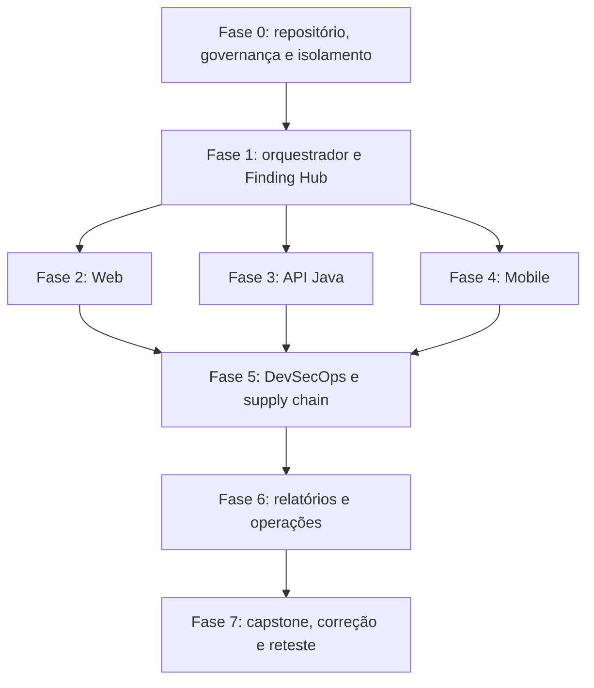

# Laboratório OWASP & PenTest — Especificação para Agente de IA

Este pacote contém a especificação completa para um agente de IA construir um
laboratório local de segurança Web, API, Mobile e infraestrutura. O material
normativo está em inglês para reduzir ambiguidades técnicas e facilitar o uso
por agentes de código; este arquivo é o ponto de entrada em português.

## Estado atual

A especificação está completa e a Fase 0 já está construída e verificada. O
comando único de bootstrap é:

```bash
node tools/repo.mjs check:all
```

São 7 verificações e 273 testes. As tarefas E0-001 a E0-006 estão concluídas;
E0-007 está bloqueada por decisões normativas em aberto, e a Fase 1 está
bloqueada porque Python não está instalado nesta máquina. O
[`README.md`](README.md) traz o inventário completo, o que cada verificação
impõe e as decisões que ainda dependem de uma pessoa.

## Resultado esperado

O agente deverá construir:

- aplicações Web vulnerável e segura completamente separadas;
- uma API Java/Spring Boot para REST, GraphQL e regras de negócio;
- aplicações Mobile React Native/Kotlin/Swift com alvos inseguros e seguros;
- um orquestrador Python com validação obrigatória de escopo;
- um Finding Hub para triagem, evidências, correção, aceite e reteste;
- pipelines GitHub Actions com TDD, cobertura ≥95%, SAST, SCA, secrets, IaC,
  DAST, API fuzzing, análise Mobile, SBOM, assinatura e proveniência;
- relatórios executivo, técnico e de reteste;
- runbooks, ADRs, threat model, contratos e templates.

## Regra central

O laboratório só pode testar aplicações próprias, alvos intencionalmente
vulneráveis ou sistemas com autorização formal. Os alvos vulneráveis devem
permanecer em loopback/rede privada. O agente não pode escanear a Internet,
publicar aplicações vulneráveis, coletar credenciais reais, enfraquecer gates ou
executar payloads destrutivos.

## Como entregar ao agente

1. Extraia completamente o ZIP no workspace do agente.
2. Instrua-o a ler [`README.md`](README.md).
3. Use o prompt pronto em
   [`docs/08-agent/06-bootstrap-prompt.md`](docs/08-agent/06-bootstrap-prompt.md).
4. Exija que ele comece na Fase 0 e na tarefa `E0-001`.
5. Não permita que pule direto para cenários vulneráveis antes de implementar
   Scope Guard, isolamento de rede e os gates básicos.

## Ordem resumida



## Documentos mais importantes

- [Escopo e limites](docs/00-overview/02-scope-non-goals.md)
- [Regras de engajamento](docs/04-security/02-rules-of-engagement.md)
- [Arquitetura do sistema](docs/02-architecture/01-system-context.md)
- [Threat model](docs/04-security/01-threat-model.md)
- [Pipeline CI/CD](docs/05-devsecops/01-cicd-architecture.md)
- [Estratégia de testes](docs/06-testing/01-test-strategy.md)
- [Manual do agente](docs/08-agent/01-operating-manual.md)
- [Backlog implementável](docs/08-agent/03-task-backlog.md)
- [Definition of Done](docs/08-agent/04-definition-of-done.md)
- [Catálogo de diagramas](docs/00-overview/06-diagram-catalog.md)
