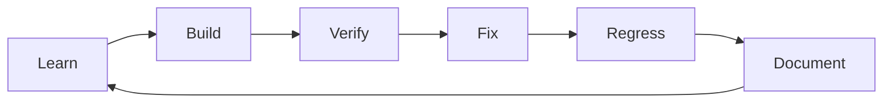

# Vision and Goals

## Vision

Create a local-first, evidence-driven security engineering laboratory where a
learner can understand a weakness at code, protocol, runtime and delivery levels
without placing third-party systems at risk.

The platform must teach both sides of application security:

- offensive verification: discover, validate and communicate a weakness;
- defensive engineering: redesign, patch, regress and prevent recurrence.

## Product outcomes

At completion, a learner can:

1. Plan and scope a controlled security assessment.
2. Map a Web, API or Mobile attack surface.
3. Perform white-, gray- and black-box verification inside the lab.
4. Read TypeScript, Python, Java, Kotlin and Swift security-sensitive code.
5. Distinguish tool output from a confirmed vulnerability.
6. Map root causes to CWE and verification controls.
7. Prioritize findings using technical severity, exploitation evidence,
   exposure, asset criticality and business impact.
8. Implement secure fixes and security regression tests.
9. Build a progressive DevSecOps pipeline rather than a single noisy scanner.
10. Deliver executive, technical and retest reports.

## Engineering goals

| ID | Goal | Success signal |
| --- | --- | --- |
| G-01 | Safe by construction | Out-of-scope targets are rejected before process creation |
| G-02 | Reproducible | A clean workstation can bootstrap the same lab from locked inputs |
| G-03 | Explainable | Each scenario documents source, sink, preconditions, impact and fix |
| G-04 | Testable | Every scenario has vulnerable proof and secure regression tests |
| G-05 | Observable | Runs, tool versions, inputs, outputs and decisions are auditable |
| G-06 | Portable | Core lab runs with Docker on Linux/macOS; Windows uses WSL2 |
| G-07 | Maintainable | Modular boundaries and ADRs prevent accidental coupling |
| G-08 | Portfolio-ready | Reports and evidence demonstrate professional methodology |

## Learning loop

## Guiding principles

- Controls are verified, not assumed.
- Automation increases coverage; it does not replace reasoning.
- A harmless proof is preferred over maximum exploitation.
- Root-cause fixes are preferred over input-specific blocking.
- Business logic and authorization require human-designed test models.
- Test coverage is a quality signal, not evidence that software is secure.
- A finding without reproducible evidence is an observation, not a confirmed
  vulnerability.

## Program-level success criteria

- All mandatory applications meet their acceptance criteria.
- No vulnerable target can bind to a non-private interface.
- At least one scenario exists for every mandatory security category.
- All confirmed findings can move through remediation and verified retest.
- All build artifacts have an SBOM, digest and provenance record.
- The capstone can be destroyed and recreated without manual data repair.

