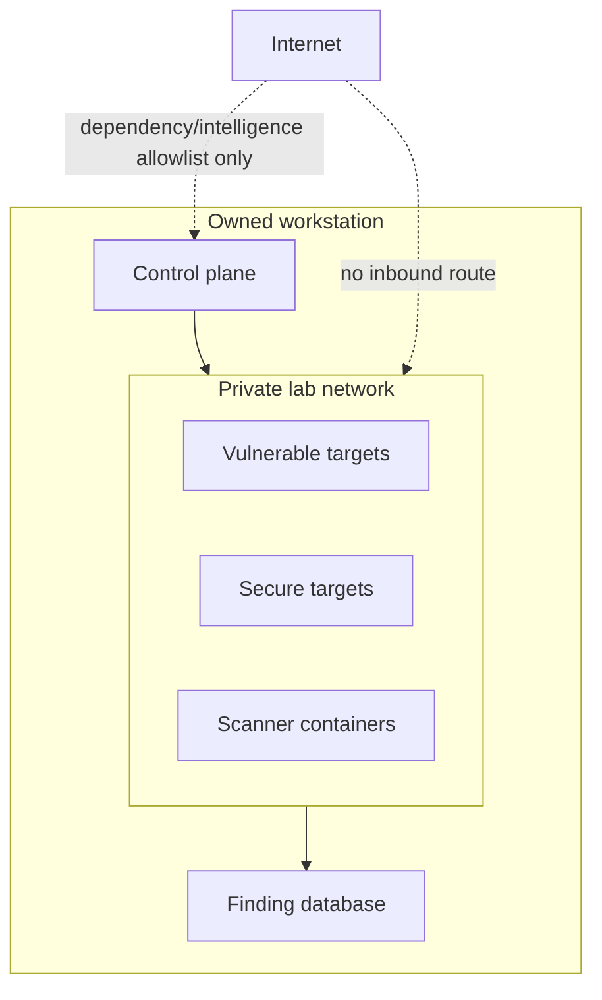

# Scope and Non-goals

## In scope

### Security domains

- Web applications and browser security.
- REST and GraphQL APIs.
- Android and iOS application security.
- Secure code review for TypeScript, Python, Java, Kotlin and Swift.
- Local network and host enumeration in an isolated range.
- Controlled Linux, Windows and Active Directory learning scenarios.
- Container, IaC and software supply-chain security.
- Vulnerability triage, reporting, remediation and retesting.
- CI/CD security automation.

### Product capabilities

- Deterministic lab provisioning and teardown.
- Signed scope definition and validation.
- Seeded users, tenants, roles and synthetic business data.
- Manual and automated verification workflows.
- Scanner adapters with safety constraints.
- SARIF-compatible finding ingestion.
- Evidence redaction, hashing and retention.
- Risk acceptance with owner and expiry.
- Executive, technical and retest reports.

## Out of scope

- Scanning arbitrary Internet targets.
- Bug bounty automation or reconnaissance against third parties.
- Phishing real users or collecting live credentials.
- Malware development, covert persistence or defense evasion.
- Uncontrolled denial-of-service or resource-exhaustion tests.
- Destructive database or filesystem payloads.
- Exploitation of current public zero-days.
- Production WAF, EDR or RASP product development.
- A multi-tenant public SaaS deployment of the vulnerable lab.
- Automatic exploitation based solely on scanner findings.

## Safety assumptions

1. The operator owns the workstation and lab network.
2. All lab identities and records are synthetic.
3. The vulnerable applications have no route from public ingress.
4. Scanner containers have the minimum network access required.
5. External vulnerability intelligence is read-only and optional.
6. A user explicitly starts active tests; passive checks may run automatically.

## Environment boundary

## Legal and operational stop conditions

Stop immediately when:

- a resolved target is outside the allowlisted private range;
- DNS resolution changes after scope validation;
- a vulnerable service is reachable from a public interface;
- real credentials, personal data or unrelated customer data appear;
- an active test causes instability beyond its declared budget;
- the kill switch, audit log or evidence redaction service is unavailable;
- scope ownership or authorization is ambiguous.

The agent must not work around these conditions. It must report the blocker and
wait for explicit operator action.

