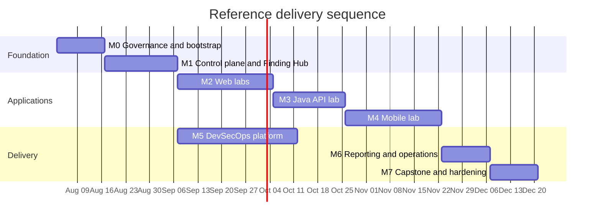
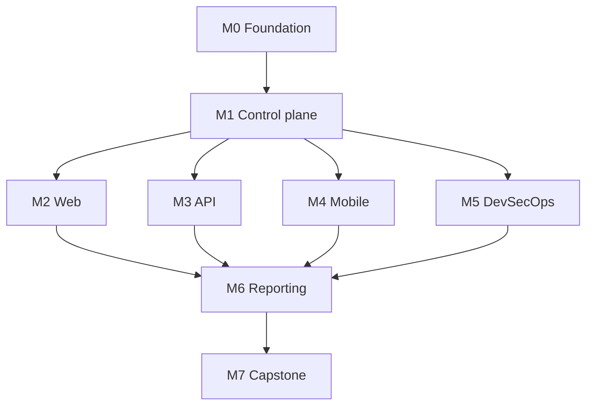

# Delivery and Learning Roadmap

## Schedule

The reference implementation is divided into eight milestones. Calendar time
depends on team size; milestone order does not.

Dates are illustrative. The implementing agent should calculate its own
schedule while preserving dependencies.

## Milestone outputs

| Milestone | Required output | Exit condition |
| --- | --- | --- |
| M0 | Repository, scope schema, local network, governance docs | Out-of-scope execution is rejected by tests |
| M1 | Orchestrator, Finding Hub, evidence store, audit trail | One synthetic scanner result completes its lifecycle |
| M2 | Separate insecure/secure Web apps | Mandatory Web scenarios pass vulnerable and secure assertions |
| M3 | Java REST/GraphQL API | Authorization and business-flow matrix is fully tested |
| M4 | Android/iOS lab targets | Required MASVS scenarios have static and dynamic evidence |
| M5 | PR/main/nightly/release pipelines | All policy gates operate on immutable artifacts |
| M6 | Reports and runbooks | Full technical, executive and retest reports are generated |
| M7 | Controlled capstone | Environment is assessed, fixed, retested and destroyed |

## Parallel work boundaries

After M1 contracts are stable, the Web, API, Mobile and pipeline workstreams may
proceed in parallel. They must not fork the canonical finding schema, scope
validator or evidence model.

## Learning cadence

For every new scenario:

- Day 0: predict the vulnerable behavior without notes.
- Day 1: locate the root cause and create a minimal proof.
- Day 3: implement the fix with TDD.
- Day 7: reproduce and retest from memory.
- Day 14: solve a variant and write the finding without a template walkthrough.

## Progress measures

Track:

- verification controls covered;
- scenarios completed end to end;
- false-positive rate and triage time;
- escaped regression count;
- test and mutation coverage;
- percentage of artifacts with SBOM and provenance;
- time to rebuild and destroy the lab;
- report completeness and remediation clarity.

Do not use number of vulnerabilities found as the primary learning metric.

