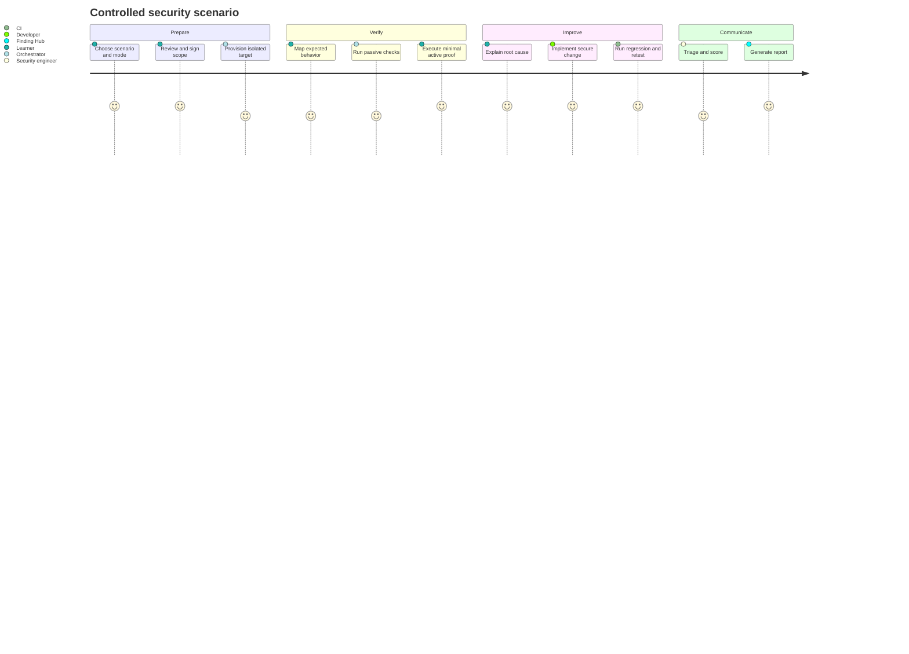

# Product Requirements Document

## Product summary

The Security Lab is a self-contained platform for building, verifying,
remediating and documenting security weaknesses across Web, API and Mobile
applications. It combines deliberately vulnerable targets, secure companion
targets, guarded test orchestration and professional finding management.

## Problem statement

Security education often separates vulnerable labs, secure development,
automation and reporting. Learners may know a payload without understanding its
root cause, or configure scanners without learning validation and remediation.
This product closes that gap by making the complete vulnerability lifecycle the
unit of learning.

## Primary users

- Learner/reviewer studying OWASP, Mobile security and PenTest+.
- Security engineer conducting a controlled verification.
- Developer implementing and validating a remediation.
- AI coding agent building the platform under explicit constraints.
- Maintainer updating scenarios, standards and tool integrations.

## Core value propositions

1. One reproducible environment connects code, runtime behavior and evidence.
2. Vulnerable and secure implementations are directly comparable.
3. Automation is constrained by scope and produces normalized results.
4. Findings are mapped, prioritized, remediated and retested.
5. Documentation and artifacts form a professional portfolio.

## User journey

## Product capabilities

### Engagement workspace

- Create a scoped engagement from a versioned template.
- Select targets, test mode, time window and safety budgets.
- Record authorization, contacts, exclusions and stop conditions.
- Track run state and kill all active adapters.

### Scenario catalog

- Browse scenarios by OWASP, CWE, ASVS, WSTG, API or MASVS mapping.
- View prerequisites without revealing the solution by default.
- Start insecure and secure targets independently.
- Reset deterministic scenario data.

### Verification workspace

- Capture manual requests and observations.
- Invoke allowlisted passive or active scanner profiles.
- Associate tool output with an engagement and immutable tool version.
- Convert an observation into a triaged finding.

### Finding lifecycle

- Deduplicate imported results.
- Confirm, reject, remediate, accept risk or request retest.
- Store redacted evidence and integrity hashes.
- Keep severity signals separate from business priority.
- Produce executive, technical and retest reports.

### Delivery platform

- Enforce code quality and security gates.
- Produce SBOMs, signatures and provenance.
- Deploy ephemeral lab targets for dynamic tests.
- Prevent publication of insecure artifacts.

## Product constraints

- Local-first; external services are optional and read-only.
- No public multi-tenant vulnerable service.
- No dependence on proprietary scanners for core acceptance.
- A commercial tool may be added only behind the same adapter contract.
- The reference implementation uses PostgreSQL and avoids a message broker until
  measured demand requires one.

## Success metrics

| Metric | Target |
| --- | --- |
| Clean bootstrap success | 100% on supported reference platforms |
| Out-of-scope adapter starts | 0 |
| Mandatory scenario lifecycle completion | 100% |
| Security regression recurrence | 0 in protected branches |
| Application test coverage | At least 95% across required dimensions |
| Evidence items with digest and provenance | 100% |
| Release artifacts with SBOM and signature | 100% |
| Expired risk acceptances on release | 0 |

## Release slices

- Alpha: CLI-only control plane, one Web scenario and Finding Hub.
- Beta: mandatory Web/API scenarios, UI, pipeline and reports.
- Mobile beta: Android and iOS targets plus MobSF integration.
- 1.0: all mandatory controls, capstone, runbooks and reproducible release.

