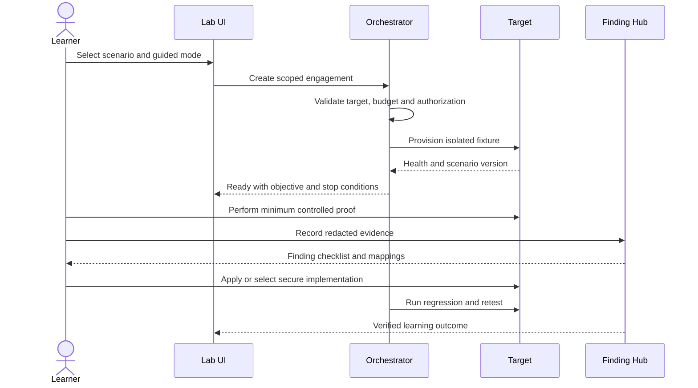
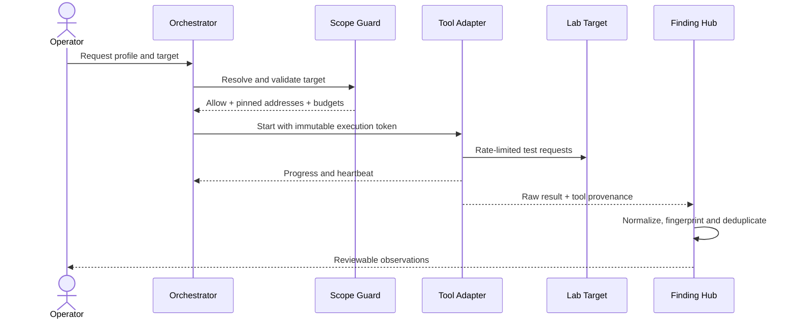

# Personas and Use Cases

## Personas

### P-01 Learner

Needs a guided but realistic environment, immediate feedback, spaced review and
a portfolio of evidence. Must be protected from accidentally targeting an
external system.

### P-02 Security engineer

Needs complete scope, repeatable tooling, raw evidence, false-positive handling,
mapping, risk reasoning and report quality.

### P-03 Developer

Needs a precise root cause, failing regression test, secure implementation
guidance and proof that the change does not break expected behavior.

### P-04 Maintainer

Needs versioned scenarios, stable identifiers, safe tool upgrades, migrations,
test fixtures and low operational overhead.

### P-05 AI build agent

Needs unambiguous requirements, dependency order, allowed autonomy, stop
conditions, acceptance commands and a definition of done.

## Primary use cases

| ID | Actor | Use case | Outcome |
| --- | --- | --- | --- |
| UC-001 | Learner | Start a guided scenario | Isolated target and scope are active |
| UC-002 | Learner | Compare insecure and secure behavior | Root cause and control are understood |
| UC-003 | Security engineer | Run an approved scan profile | Audited, normalized results are produced |
| UC-004 | Security engineer | Confirm a finding | Evidence and mappings are complete |
| UC-005 | Developer | Remediate a finding | Fix and regression test are submitted |
| UC-006 | Security engineer | Retest a remediation | Finding becomes verified or reopens |
| UC-007 | Maintainer | Add a scenario | Catalog, tests and mappings remain consistent |
| UC-008 | Maintainer | Upgrade a scanner | Tool digest and compatibility evidence change together |
| UC-009 | AI agent | Implement a milestone | All exit criteria pass without weakening controls |
| UC-010 | Learner | Run a capstone | Full report and retest package are generated |

## Use-case flow: guided scenario

## Use-case flow: scanner execution

## Edge cases

- Target resolves to a different address after validation: cancel the run.
- Target becomes unhealthy: pause active tests and preserve partial evidence.
- Tool exits without a final report: mark run incomplete, not successful.
- Duplicate result: link the occurrence to the canonical finding.
- Secure target exhibits vulnerable behavior: fail the milestone immediately.
- Insecure target is unreachable from public ingress test: expected pass.
- Risk acceptance expires: release gate fails until renewed or remediated.

