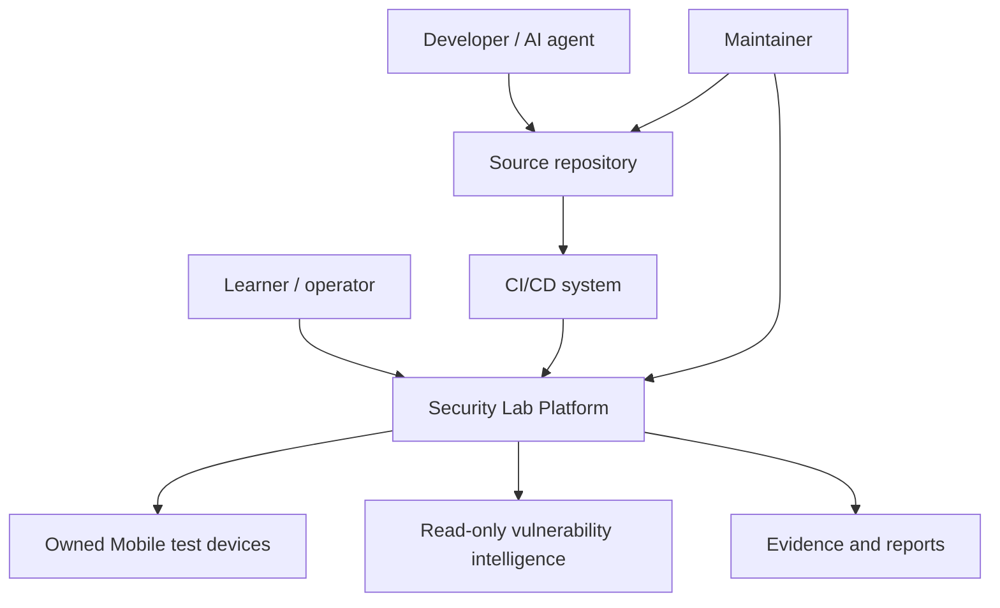
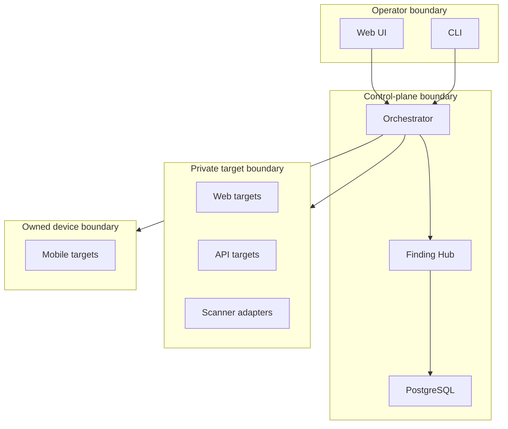

# System Context Architecture

## Context

The Security Lab runs on an owned workstation or isolated CI runner. It
coordinates intentionally vulnerable targets, secure companion targets,
approved security tools, Mobile test devices and a finding-management system.

## Actors and external systems

| Element | Responsibility | Trust note |
| --- | --- | --- |
| Learner/operator | Selects scenario, signs scope, confirms active tests | Human authorization boundary |
| AI build agent | Implements code and documentation | Cannot expand scope or weaken controls |
| Maintainer | Reviews releases, mappings and tool upgrades | Privileged repository role |
| GitHub Actions | Builds and verifies immutable candidates | OIDC and least privilege required |
| Android/iOS device | Runs owned test applications | Dedicated emulator/simulator/device |
| Vulnerability intelligence | Optional CVE/EPSS/KEV enrichment | Read-only, untrusted external data |

## C4-style context

## Trust boundaries

## High-level data flows

1. Operator submits a scope and scenario request.
2. Orchestrator canonicalizes and validates every target.
3. Provisioner starts only the required isolated services.
4. Manual or automated verification produces observations and evidence.
5. Finding Hub normalizes, fingerprints and stores records.
6. Developer submits remediation and regression tests.
7. CI creates an exact candidate, runs security verification and supplies
   immutable artifacts to retest.
8. Report Generator produces redacted outputs.

## Architectural invariants

- The target plane never authorizes itself.
- Tool containers cannot write directly to the canonical finding database.
- The Finding Hub never starts security tools.
- CI cannot publish insecure targets.
- Reports do not embed raw evidence by default.
- External intelligence cannot change finding state or priority by itself.

