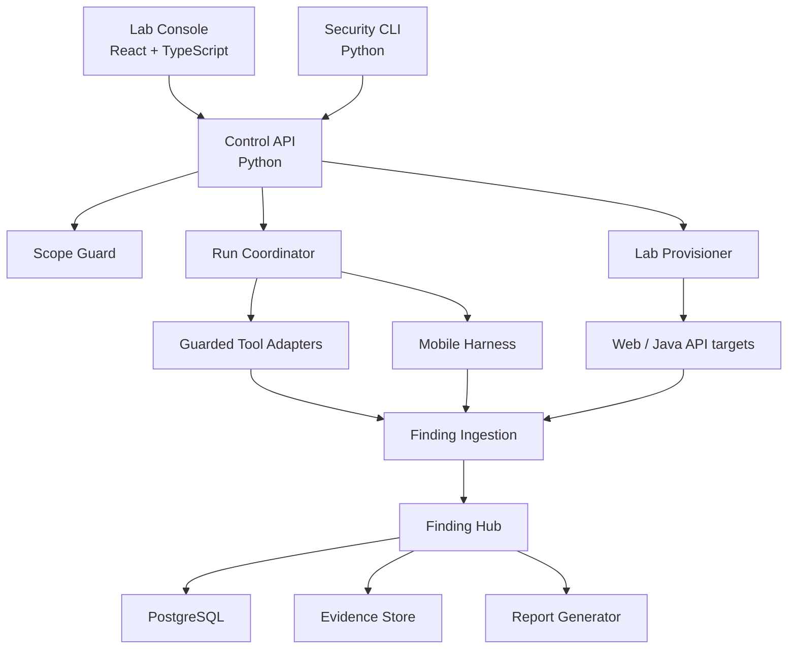
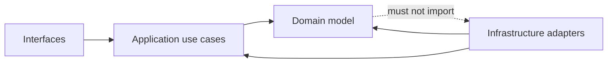

# Container and Component Architecture

## Logical containers

## Control plane components

### Scope Guard

- Parses signed scope documents.
- Canonicalizes hostnames, URLs, IPs and CIDRs.
- Resolves DNS through an injected resolver.
- Rejects public, loopback-unexpected, link-local, metadata and excluded ranges.
- Pins allowed addresses for the run.
- Issues a short-lived immutable execution grant.

### Run Coordinator

- Implements the run state machine.
- Applies budgets and profile policy.
- Starts only registered adapters.
- Receives heartbeat and progress events.
- Executes pause, cancel and kill behavior.
- Finalizes a run only after adapter and ingestion acknowledgement.

### Lab Provisioner

- Creates an isolated network per engagement.
- Starts target dependencies and deterministic fixtures.
- Verifies target metadata and public-exposure assertions.
- Tracks resources for idempotent teardown.

### Adapter Registry

- Maps a fixed adapter ID to an immutable container digest and typed command.
- Declares passive/active classification and supported artifacts.
- Provides schemas for settings and normalized output.

## Finding plane components

### Ingestion boundary

- Validates document size, schema and encoding.
- Rejects path traversal, archive bombs and external references.
- Stores raw results in quarantined content-addressed storage.
- Converts supported formats into the internal occurrence model.

### Fingerprint and deduplication

- Uses tool-independent normalized location when available.
- Preserves one canonical finding and multiple occurrences.
- Never automatically merges results across different assets or tenants.
- Supports reviewer split and merge with audit records.

### Workflow engine

- Enforces legal state transitions.
- Requires role and reason for privileged transitions.
- Starts retest work from an immutable snapshot of original conditions.
- Expires risk acceptances automatically.

## Target plane components

- `web-insecure`: deliberately vulnerable Web application.
- `web-secure`: secure behavior baseline.
- `api-java`: REST and GraphQL business API with isolated scenario modules.
- `mobile-insecure`: non-releaseable Android/iOS lab target.
- `mobile-secure`: secure companion target.
- target-local PostgreSQL instances or schemas with synthetic fixtures.

## Dependency direction

Domain code must not import framework, database, process execution or scanner
SDK packages.

