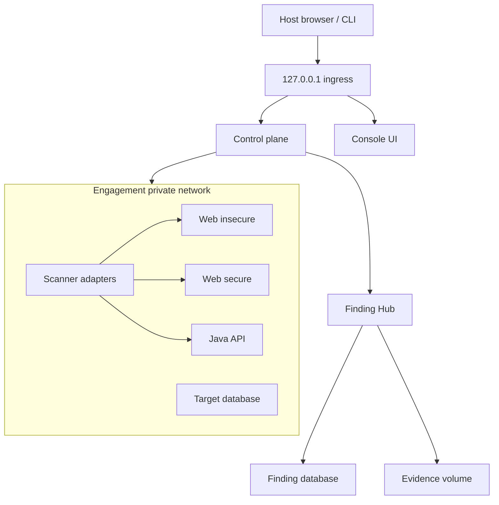
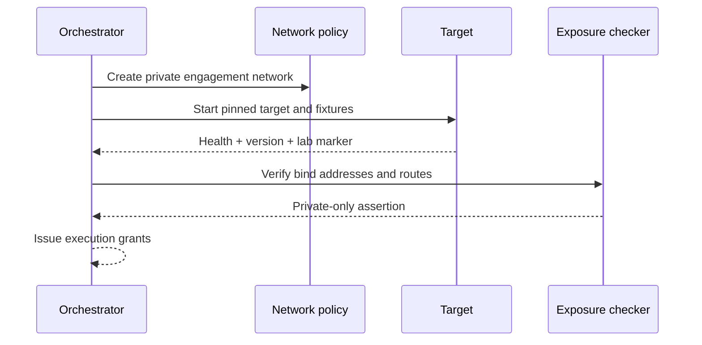

# Runtime and Deployment Architecture

## Local topology

The default environment is a Docker network per engagement. Only the console
and control API may bind to loopback. Vulnerable targets remain internal and are
reached through the orchestrator or an explicit local proxy port.

## Network policy

- Deny inbound traffic from non-loopback host interfaces.
- Deny target egress by default.
- Allow target-to-target traffic only where a scenario explicitly requires it.
- Place scanner adapters on a network that reaches scoped targets and the
  ingestion endpoint only.
- Route optional intelligence lookup through a separate egress proxy allowlist.
- Block cloud metadata, link-local and host-control endpoints.
- Re-run exposure assertions after every topology change.

## Environment classes

| Environment | Purpose | Active testing | Retention |
| --- | --- | --- | --- |
| Local | Interactive learning and development | Explicitly confirmed | Operator-controlled |
| PR ephemeral | Unit, integration and passive dynamic checks | Limited profiles | Destroy after job |
| Main ephemeral | Full build and integration | Approved bounded profiles | Destroy after job |
| Nightly isolated | Authenticated DAST, fuzzing and Mobile analysis | Yes, lab only | Findings retained |
| Release verification | Test exact secure candidate | Bounded | Evidence retained |

There is no public environment for vulnerable targets.

## Startup sequence

If any assertion fails, the orchestrator tears down the target and records a
blocked environment event.

## Mobile topology

- Android uses a dedicated emulator or owned lab device with a disposable data
  profile.
- iOS uses Simulator for supported tests and an owned dedicated device for
  device-only tests.
- Proxies and certificates are installed only in the lab profile.
- The Mobile application connects exclusively to the private Java API endpoint.
- Device logs and screenshots are evidence inputs and pass through redaction.

## Teardown

Teardown stops adapters first, revokes grants, captures final logs, removes
targets and networks, verifies closed ports and finally marks the engagement
environment destroyed. Failure is retryable and never hidden.

