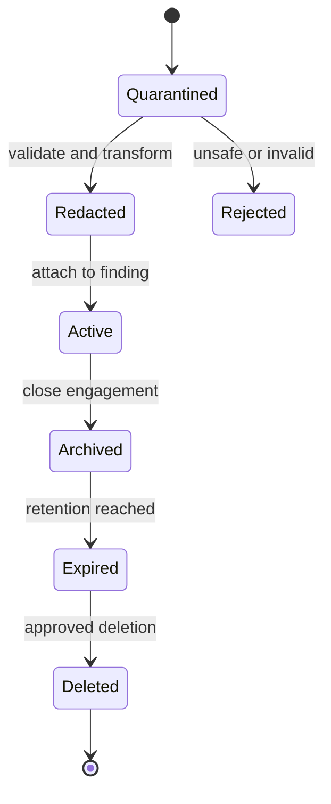

# Data Architecture

## Data domains

| Domain | Owner | Examples |
| --- | --- | --- |
| Governance | Orchestrator | scope, authorization, engagement, budgets |
| Execution | Orchestrator | run, adapter, heartbeat, tool provenance |
| Security knowledge | Finding Hub | finding, occurrence, mapping, remediation, retest |
| Evidence | Evidence service | redacted request, screenshot, log, report attachment |
| Supply chain | Delivery platform | SBOM, digest, signature, provenance |
| Learning | Scenario catalog | objective, hints, mappings, completion |

## Storage decisions

- PostgreSQL is the system of record for structured data.
- Evidence bytes use content-addressed filesystem/object storage; PostgreSQL
  stores metadata and digests.
- Raw scanner outputs are quarantined and immutable after ingestion.
- Domain events use a PostgreSQL transactional outbox.
- Search starts with PostgreSQL indexes and full text. External search is not a
  1.0 dependency.
- Analytics derive from events or read models; they do not mutate source data.

## Data classification

| Class | Examples | Handling |
| --- | --- | --- |
| Public | Standards links, scenario titles | May appear in documentation |
| Internal | Synthetic findings, run metadata | Authenticated local access |
| Sensitive | Evidence, tokens, raw requests | Redacted, encrypted, retention-controlled |
| Restricted | Authorization records, signing material | Minimum access, never included in reports |

## Integrity model

Each evidence item has:

- SHA-256 digest of stored redacted bytes;
- original media type and byte length;
- creator, engagement and timestamp;
- redaction policy version;
- source tool and run when applicable;
- optional signature or manifest membership;
- immutable lineage to replacements or derived previews.

## Retention lifecycle

Deletion preserves a tombstone containing the digest, authorization, deletion
time and reason, but not the evidence bytes.

## Backup scope

- Back up Finding Hub database, evidence manifests and approved evidence.
- Do not back up rebuildable vulnerable target data.
- Do not back up ephemeral tool containers or caches.
- Encrypt backups and test restore into an isolated environment.

Detailed entities and relationships are in
[Domain model](../07-data-api/01-domain-model.md) and
[Database schema](../07-data-api/02-database-schema.md).

