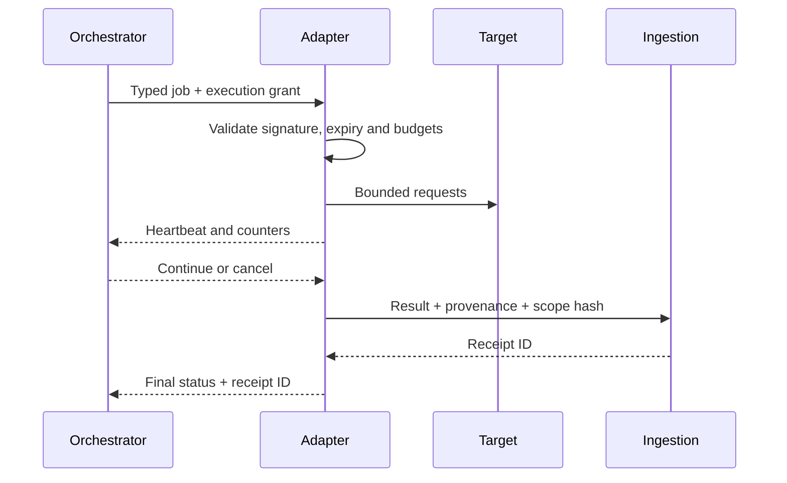

# Integrations and Contract Architecture

## Integration principles

- Contracts are versioned before implementation.
- External input is untrusted even when produced by a security tool.
- The canonical model is tool-neutral.
- Integrations use typed data, never arbitrary commands.
- Retries are idempotent and observable.
- Optional external services cannot block core local operation.

## Contract catalog

| Contract | Producer | Consumer | Format |
| --- | --- | --- | --- |
| Scope document | Operator/UI | Orchestrator | YAML/JSON validated by JSON Schema |
| Execution grant | Scope Guard | Tool adapter | Signed short-lived JSON token |
| Adapter result | Tool adapter | Ingestion | SARIF or internal occurrence JSON |
| Run event | Orchestrator | Finding Hub/read models | Versioned domain event |
| Finding API | Finding Hub | Console/reporting | OpenAPI JSON over loopback/private network |
| Scenario catalog | Repository | UI/CI | Versioned JSON/YAML, no executable strings |
| SBOM | Build pipeline | Finding Hub/release | CycloneDX JSON or SPDX JSON |
| Provenance | Build pipeline | Release verifier | in-toto/SLSA-compatible statement |

## Tool adapter protocol

An adapter declares:

- immutable `adapter_id` and semantic contract version;
- tool name, version and image digest;
- passive or active classification;
- accepted target schemes and artifact types;
- typed configuration schema;
- default and maximum safety budgets;
- output formats and normalization version;
- heartbeat and cancellation behavior.

The orchestrator supplies an execution grant. The adapter must validate it and
must not accept an operator-provided command line.

## External intelligence

Adapters may retrieve CVE, EPSS or KEV data through a read-only enrichment
service. Responses are cached with source and retrieval time. Enrichment cannot
create, confirm, close or prioritize a finding without policy and human-visible
rationale.

## Compatibility policy

- Backward-compatible additions keep the major contract version.
- Removed or redefined fields require a new major version.
- Consumers support the current and immediately previous major version during
  migration.
- Every contract includes examples, schema validation and consumer tests.
- Generated clients are regenerated in CI and checked for an empty diff.

