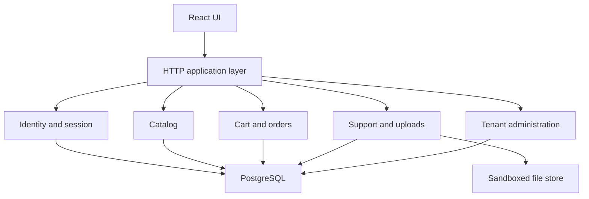

# Web Lab Application Specification

## Purpose

Build two separate applications with equivalent business features:

- `web-lab-insecure`: contains explicit, isolated teaching scenarios;
- `web-lab-secure`: implements the correct controls and acts as the regression
  baseline.

The insecure target is not a production application and must never be publicly
deployed.

## Technology boundary

- React and TypeScript for the browser application.
- NestJS or an equivalent structured TypeScript server framework.
- PostgreSQL with independent insecure and secure databases.
- Local object/file sandbox for upload scenarios.
- OpenAPI generated from server contracts.
- Vitest/Jest-compatible unit tests, Supertest-style integration tests and
  Playwright end-to-end tests.

Exact dependency versions are selected at bootstrap, pinned and recorded.

## Business features

- Registration, login, logout, MFA enrollment and password recovery.
- Product catalog, search and product detail.
- Cart, coupon, checkout and order history.
- Profile, addresses and document upload.
- Support tickets with rich-text comments and attachments.
- Tenant administration, user roles and audit log.
- Import URL function backed by a local mock service.

## Personas and seeded identities

| Identity | Tenant | Role | Purpose |
| --- | --- | --- | --- |
| `alice@example.test` | Alpha | customer | Ownership tests |
| `bob@example.test` | Alpha | customer | Horizontal-access tests |
| `carol@example.test` | Beta | manager | Tenant-isolation tests |
| `admin@example.test` | Alpha | administrator | Vertical-access tests |
| `support@example.test` | Alpha | support | Function-level authorization tests |

Credentials and tokens are synthetic, generated on reset and never reused
outside the lab.

## Mandatory scenarios

| ID | Weakness | Minimal proof boundary | Secure expectation |
| --- | --- | --- | --- |
| WEB-AUTH-001 | User enumeration | Compare synthetic account responses | Uniform external behavior and monitored rate limits |
| WEB-AUTH-002 | Weak recovery lifecycle | Reuse a seeded reset token once | Single-use, short-lived, bound token |
| WEB-SESS-001 | Session fixation/invalidation | Observe seeded session continuity | Rotation and server-side invalidation |
| WEB-AC-001 | Object-level access failure | Read one Bob canary order as Alice | Ownership enforced server-side |
| WEB-AC-002 | Function-level access failure | Invoke one admin action as support | Central deny-by-default authorization |
| WEB-INJ-001 | SQL injection | Return a canary row only | Parameterized query and least privilege |
| WEB-INJ-002 | Command injection sink | Create a harmless marker in sandbox | No shell; typed library call and allowlist |
| WEB-XSS-001 | Stored/DOM output handling | Execute a local test marker | Contextual encoding and safe DOM APIs |
| WEB-CSRF-001 | State change without anti-CSRF | Change synthetic preference | SameSite plus validated anti-CSRF control |
| WEB-CORS-001 | Overbroad origin trust | Read canary response from lab origin | Explicit trusted origin and credential policy |
| WEB-SSRF-001 | Server-side URL fetch | Reach local mock metadata endpoint | Scheme/host allowlist and network egress denial |
| WEB-UPLOAD-001 | Unsafe upload | Store harmless mismatched test file | Content validation, generated name, isolated storage |
| WEB-PATH-001 | Path traversal | Read one seeded canary file | Canonical path containment |
| WEB-LOGIC-001 | Coupon/business abuse | Apply a coupon twice to synthetic cart | Domain invariant and idempotency |
| WEB-RACE-001 | Concurrent state race | Exceed synthetic balance by bounded requests | Transactional locking/idempotency |
| WEB-ERROR-001 | Exceptional-condition leak | Trigger controlled validation error | Generic response, structured internal log |
| WEB-SUPPLY-001 | Dependency/asset integrity | Detect seeded vulnerable fixture package | Locked/patched dependency and integrity policy |
| WEB-LOG-001 | Missing detection | Trigger repeated denied actions | Correlated event and alert threshold |

## Component architecture

## Authorization model

- Server-side policy is authoritative.
- Default deny for non-public actions.
- Object ownership and tenant membership are separate checks.
- Roles grant actions, not unrestricted object access.
- UI hiding is convenience, never authorization.
- Authorization matrix tests cover anonymous, customer, support, manager and
  administrator for every protected operation.

## Secure implementation requirements

- Framework-managed password hashing with current safe parameters.
- Short-lived sessions/tokens, rotation at privilege change and revocation.
- Parameterized data access and no request-derived shell execution.
- Context-aware output encoding and a restrictive CSP.
- Anti-CSRF controls for cookie-authenticated state changes.
- Explicit CORS and trusted proxy configuration.
- Egress-denied URL retrieval through a hardened fetch service.
- Upload quarantine, generated identifiers and non-executable storage.
- Domain-level invariants and idempotency for financial/business actions.
- Consistent error handling, correlation IDs and security event logging.

## Scenario acceptance pattern

Every scenario must include:

1. A vulnerable assertion that demonstrates only bounded synthetic impact.
2. A source-level test identifying the intended root cause.
3. A secure assertion using the same external contract.
4. An integration or end-to-end regression test.
5. Finding metadata and standards mappings.
6. Reset and cleanup verification.

