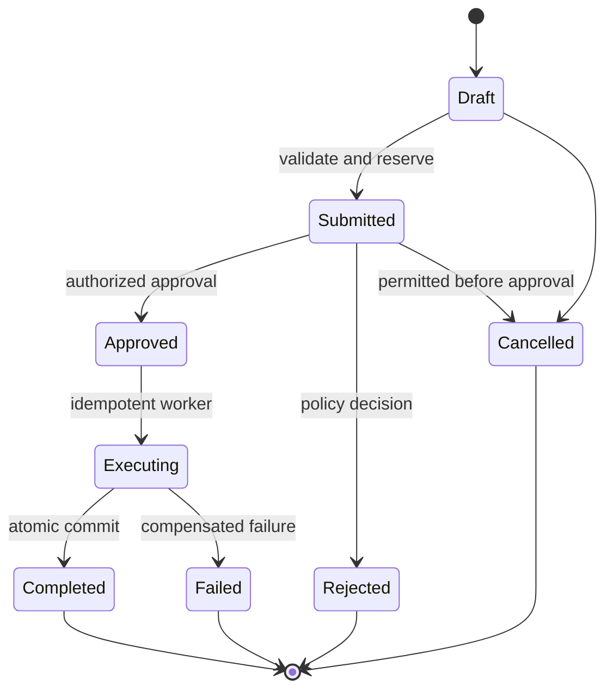
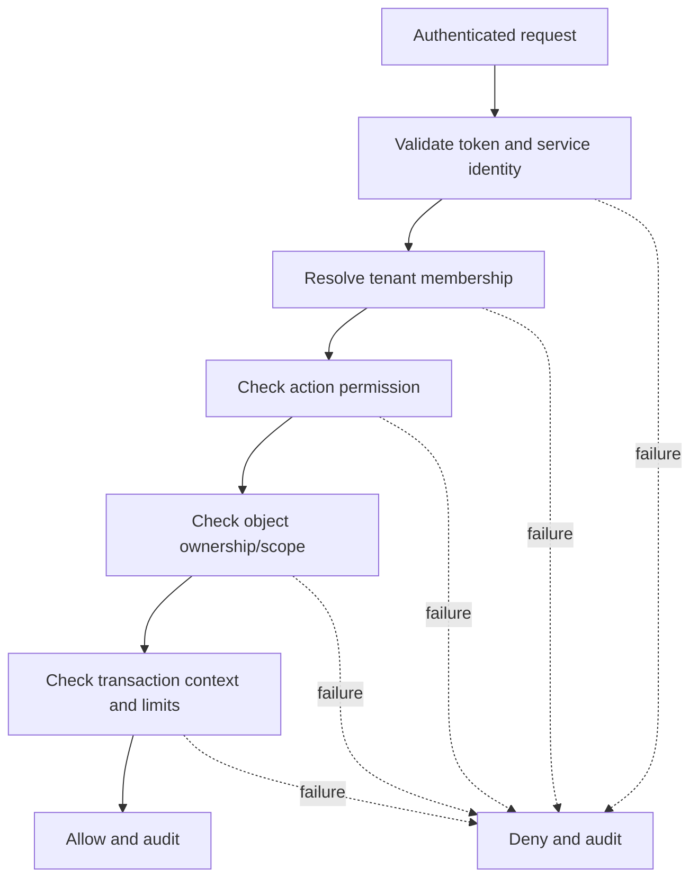

# Java API Lab Specification

## Purpose

The Java API provides a bank-like synthetic domain for REST, GraphQL,
authorization, workflow and server-to-server security scenarios. It exposes
equivalent vulnerable and secure scenario routes under separate deployable
profiles that cannot coexist in a release build. Prefer separate modules or
artifacts over runtime feature flags.

## Technology boundary

- Current supported Java LTS selected and pinned at bootstrap.
- Spring Boot with explicit security configuration.
- PostgreSQL and database migrations.
- REST OpenAPI contract plus bounded GraphQL schema.
- JUnit 5, Testcontainers, property tests where useful and PIT mutation tests.
- No embedded production secrets or default administrator credentials.

## Domain

- Customer and tenant.
- Account and balance.
- Beneficiary.
- Transfer and transfer approval.
- Statement and document.
- Service credential and outbound integration.
- Audit event.

## API surface

| Capability | REST | GraphQL |
| --- | --- | --- |
| Identity/profile | Read/update own profile | `viewer` |
| Accounts | List/read authorized accounts | account query |
| Beneficiaries | Create/list/delete | beneficiary query/mutation |
| Transfers | Create/approve/cancel/status | transfer mutation/query |
| Statements | Generate/download | metadata query only |
| Administration | Tenant/user/limits | restricted admin mutations |

## Mandatory scenarios

| ID | Scenario | Secure control |
| --- | --- | --- |
| API-BOLA-001 | Cross-account object lookup | Subject, tenant and object authorization |
| API-BFLA-001 | Customer invokes approval/admin function | Method-level deny-by-default policy |
| API-PROP-001 | Mass assignment changes restricted field | Explicit command DTO and server-owned fields |
| API-AUTH-001 | Token validation ambiguity | Issuer, audience, signature, time and scope validation |
| API-FLOW-001 | Unlimited beneficiary/transfer flow | Risk-based rate and workflow limits |
| API-RESOURCE-001 | Unbounded pagination/GraphQL complexity | Server caps, cost and timeout budgets |
| API-SSRF-001 | Untrusted integration URL | Registered integrations and egress policy |
| API-INVENTORY-001 | Deprecated API remains reachable | Version inventory and removal tests |
| API-CONSUME-001 | Unsafe trust in upstream data | Schema validation, timeout and output handling |
| API-GQL-001 | Resolver-level authorization gap | Authorization on every resolver/object boundary |
| API-GQL-002 | Alias/batching resource abuse | Query depth, complexity and batch limits |
| API-RACE-001 | Double transfer/approval | Idempotency key and transactional state machine |

## Transfer state machine

Illegal transitions must be rejected in the domain layer, not only at the
controller.

## Authorization decision

## GraphQL requirements

- Authorization runs at resolver and domain-service boundaries.
- Introspection policy is explicit per environment.
- Query depth, complexity, aliases, batch count, result size and timeout are
  bounded.
- Errors do not expose stack traces, internal types or SQL details.
- DataLoader or batching cannot cross tenant/authorization contexts.
- Schema changes are contract-tested.

## Testing requirements

- Authorization matrix for all operations and roles.
- State-model tests for every transfer transition.
- Concurrent idempotency tests.
- OpenAPI and GraphQL schema compatibility tests.
- Testcontainers integration with real PostgreSQL behavior.
- A vulnerable test suite that proves the intended lab weakness only.
- Secure regression tests that fail if a scenario reappears.

