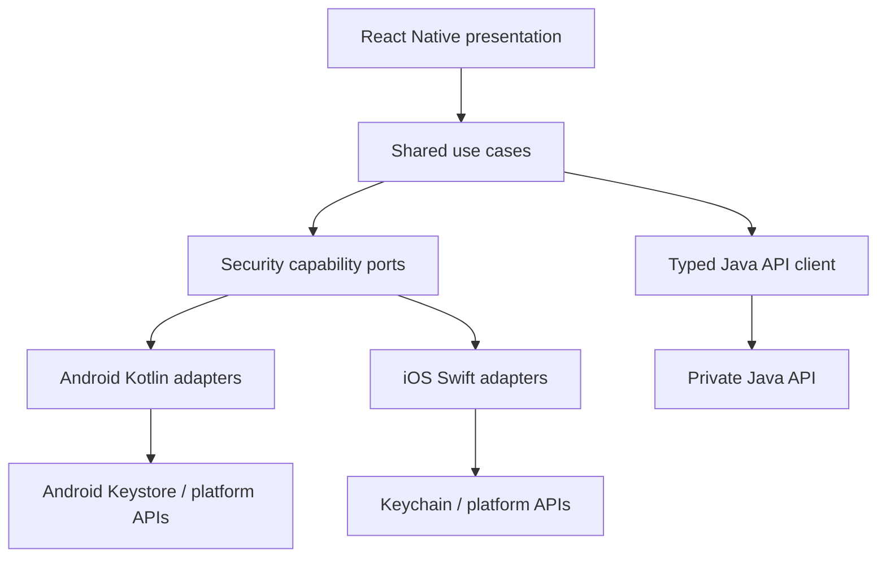

# Mobile Security Lab Specification

## Purpose

Build a React Native bare application with explicit Android and iOS native
targets for demonstrating and correcting MASVS-aligned weaknesses. The app uses
the Java API and synthetic financial data.

## Target separation

| Target | Identifier suffix | Release signing | Visible marker |
| --- | --- | --- | --- |
| Android insecure | `.insecurelab` | Forbidden | Persistent red lab banner |
| Android secure | `.securelab` | Allowed for local signed candidate | Green secure-lab banner |
| iOS insecure | `.insecurelab` | Development-only | Persistent red lab banner |
| iOS secure | `.securelab` | Development/ad-hoc lab | Green secure-lab banner |

Unsafe adapters and fixtures live in an isolated insecure target/module and
cannot be imported by secure targets.

## User features

- Login and session restoration.
- Account summary and synthetic statements.
- Beneficiary and transfer workflow.
- Document download and local viewing.
- Support WebView for approved local content.
- Deep link into transfer confirmation.
- Notification and clipboard interactions.
- Local biometric confirmation for a sensitive action.

## Mandatory MASVS coverage

| ID | Control group | Insecure scenario | Secure expectation |
| --- | --- | --- | --- |
| MOB-STOR-001 | STORAGE | Token/canary in inappropriate storage or logs | Platform protected storage and log redaction |
| MOB-STOR-002 | STORAGE | Sensitive backup inclusion | Backup exclusion and data minimization |
| MOB-CRYPTO-001 | CRYPTO | Hardcoded/weak key handling fixture | Keystore/Keychain-backed key lifecycle |
| MOB-AUTH-001 | AUTH | Local biometric result not bound to operation | Cryptographic binding and server authorization |
| MOB-AUTH-002 | AUTH | Session remains after logout | Local deletion and server revocation |
| MOB-NET-001 | NETWORK | Overbroad cleartext/ATS exception | TLS-only explicit network policy |
| MOB-NET-002 | NETWORK | Insecure certificate validation fixture | Platform validation and tested pinning policy if required |
| MOB-PLAT-001 | PLATFORM | Exported component/deep-link trust | Restricted component and validated link parameters |
| MOB-PLAT-002 | PLATFORM | Unsafe WebView bridge/content | Origin-scoped messaging and trusted content only |
| MOB-PLAT-003 | PLATFORM | Clipboard/screenshot/notification leak | Minimized, masked and lifecycle-cleared data |
| MOB-CODE-001 | CODE | Debuggable/verbose release fixture | Release hardening and artifact checks |
| MOB-CODE-002 | CODE | Vulnerable dependency fixture | Locked, patched and scanned dependency |
| MOB-RES-001 | RESILIENCE | Secret recoverable from basic static analysis | No client secret; appropriate obfuscation/hardening |
| MOB-RES-002 | RESILIENCE | Runtime integrity signal ignored | Defense-in-depth signal with safe server policy |
| MOB-PRIV-001 | PRIVACY | Excess permissions/data collection | Permission minimization and explicit disclosure |

## Mobile architecture

## Platform requirements

### Android

- Explicit component export declarations.
- Minimal permissions and target SDK selected at bootstrap.
- Network Security Configuration reviewed in CI.
- Keystore-backed sensitive keys.
- No sensitive logs, screenshots, notifications or backups.
- APK signing and manifest inspection in pipeline.

### iOS

- Minimal entitlements and URL handlers.
- App Transport Security without broad exceptions.
- Keychain accessibility class selected by data lifecycle.
- Data Protection applied to stored files.
- No sensitive logs, pasteboard persistence or background snapshots.
- Entitlements, signing settings and `Info.plist` diffed in CI.

## Dynamic analysis boundary

Dynamic instrumentation is performed only on owned lab builds using dedicated
emulators, simulators or devices. The goal is to observe runtime behavior and
verify controls, not to evade protections on third-party applications.

## Acceptance

- Static build inspection detects every seeded insecure artifact scenario.
- Secure targets pass the same checks with documented intentional exceptions.
- Network interception tests use only the lab API and certificates.
- Each Mobile scenario includes source review, runtime evidence and fix.
- Reinstall/reset removes all prior scenario data.

