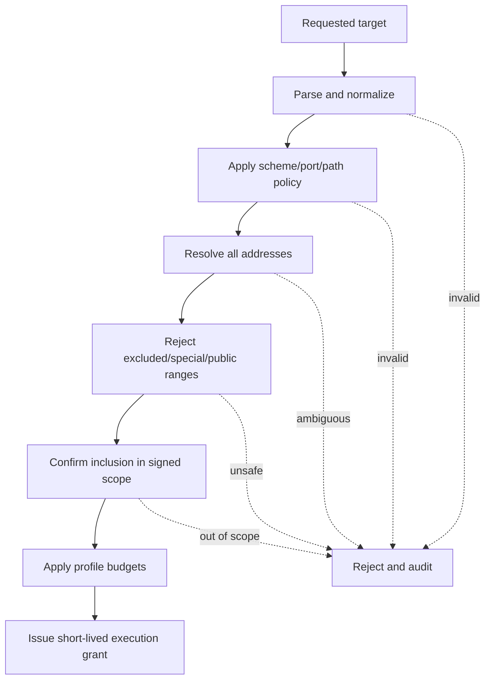
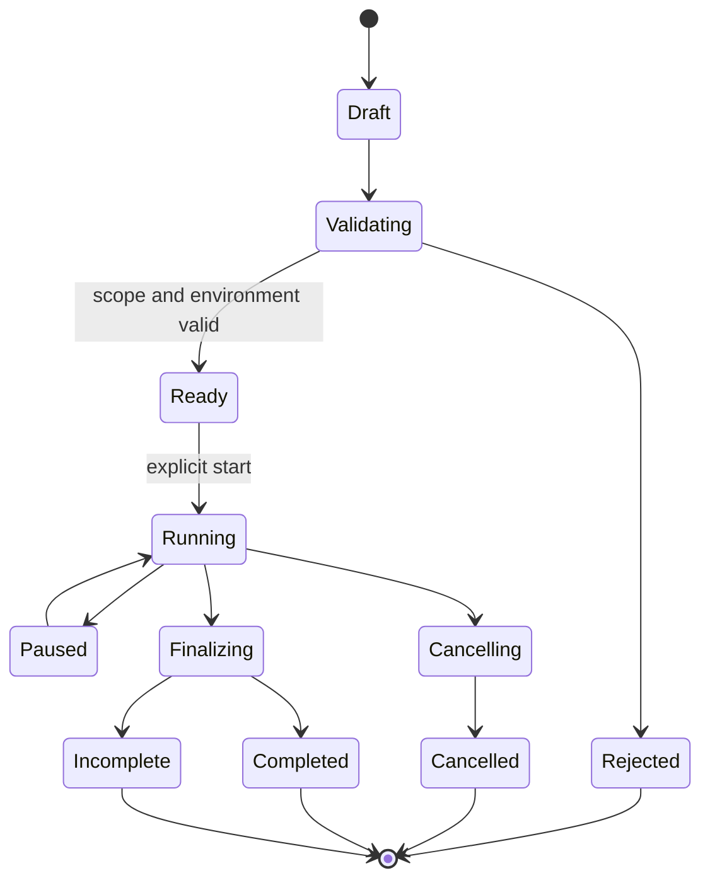

# Security Orchestrator Specification

## Purpose

The Python orchestrator is the safety-critical control plane. It provisions
engagement environments, validates scope, invokes approved adapters, enforces
budgets and coordinates ingestion. It is not an arbitrary command runner.

## Modules

| Module | Responsibility |
| --- | --- |
| `scope` | Parse, canonicalize, validate and hash scope |
| `grants` | Issue and verify short-lived execution grants |
| `runs` | Run state machine and idempotent operations |
| `budgets` | Rate, concurrency, request, byte and duration limits |
| `adapters` | Registry and typed adapter invocation |
| `provisioning` | Compose/device lifecycle and exposure assertions |
| `audit` | Append-only structured security events |
| `cli` | Human interface using the same application services as API |
| `api` | Loopback/private control API |

## Scope document

Required fields:

- `scope_version`;
- `engagement_id`;
- authorization reference and signer;
- validity start/end;
- allowed URLs, hostnames, IPs and CIDRs;
- excluded targets and paths;
- allowed adapter profiles;
- safety budgets;
- data handling and stop contacts;
- signature or local approval record.

## Validation algorithm

Validation repeats for redirects, proxy CONNECT targets and any secondary host
identified by an adapter. DNS answers are pinned for the execution.

## Run state machine

Only `Completed` represents acknowledged final result ingestion. Process exit
code zero alone is insufficient.

## Tool execution requirements

- Use fixed entrypoint and typed argument array.
- Never pass user input through a shell.
- Mount read-only configuration and output-only result volume.
- Run with non-root identity and restricted capabilities where tool support
  permits.
- Deny network except scoped targets and ingestion/heartbeat endpoints.
- Enforce OS-level resource limits in addition to application budgets.
- Record stdout/stderr with size limits and redaction.

## Initial adapter profiles

- ZAP passive baseline.
- ZAP bounded authenticated API/Web scan.
- Semgrep/CodeQL result importer.
- Trivy filesystem/image/SBOM importer.
- Gitleaks importer.
- Schemathesis bounded API contract test.
- MobSF static analysis importer.
- Nmap safe discovery profile for private lab ranges.

## Safety tests

- Public IPv4/IPv6 rejection.
- Encoded/alternate address representation rejection.
- DNS answer drift and rebinding.
- Redirect out of scope.
- Proxy and URL-userinfo ambiguity.
- Command argument injection.
- Excessive configuration values.
- Kill during every run state.
- Adapter heartbeat loss and partial output.
- Audit-store failure blocks privileged execution.

