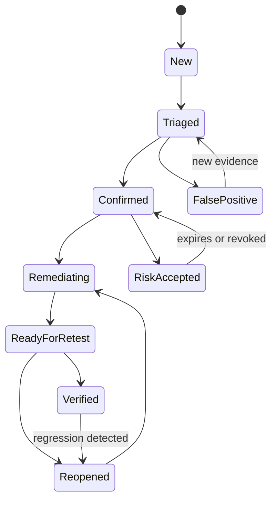

# Finding Hub Specification

## Purpose

The Finding Hub is the canonical workflow for observations, findings,
remediations, evidence, risk acceptances and retests. It preserves raw tool
provenance while presenting a tool-neutral security record.

## Capabilities

- Ingest SARIF and internal occurrence documents.
- Validate and quarantine untrusted inputs.
- Normalize rules, assets, locations and mappings.
- Fingerprint and deduplicate occurrences.
- Manage finding lifecycle and role-based decisions.
- Store redacted evidence and integrity metadata.
- Keep severity and priority signals separate.
- Generate read models for UI and reports.
- Import SBOM and artifact metadata.

## Finding lifecycle

## Confirmation requirements

A reviewer cannot confirm a finding without:

- scoped asset and affected component;
- reproducible conditions;
- redacted evidence;
- technical impact and root cause;
- confidence level;
- primary CWE or documented reason it is unavailable;
- remediation direction;
- reporter/reviewer identity and timestamp.

## Fingerprinting

The fingerprint algorithm uses, in decreasing preference:

1. Repository, stable rule family and normalized semantic location.
2. Asset, route/operation, weakness and normalized parameter/context.
3. Artifact digest, package identifier and vulnerability identifier.
4. Tool fingerprint only as a source-specific fallback.

Fingerprints are versioned. A new algorithm never mutates historical identity
without a recorded migration.

## Risk decision model

Display separately:

- CVSS v4 vector/score;
- exploit evidence: demonstrated, KEV, public exploit reference or none;
- EPSS when a CVE exists;
- external/internal reachability;
- asset and data criticality;
- control effectiveness;
- finding confidence;
- business impact and priority;
- decision rationale and owner.

Suggested policy, not a mathematical standard:

- P0: proven/known exploitation on a reachable critical asset.
- P1: high impact, meaningful exposure and high confidence.
- P2: material weakness with prerequisites or effective controls.
- P3: defense-in-depth or hygiene issue with low immediate impact.

## Evidence behavior

- Reject files exceeding configured size or type limits.
- Never render active HTML/SVG from untrusted evidence.
- Store safe previews separately from originals.
- Redact tokens, cookies, authorization headers and seeded secrets.
- Hash stored redacted bytes and include digest in report manifest.

## Workflow permissions

| Action | Minimum role |
| --- | --- |
| Create observation | Tester/developer |
| Triage | Security reviewer |
| Confirm/false-positive | Security reviewer |
| Submit remediation | Developer |
| Mark ready for retest | Developer + passing CI |
| Verify/reopen | Independent tester/reviewer |
| Accept risk | Named risk owner |
| Delete evidence bytes | Data custodian with recorded reason |

## UI read models

- Engagement dashboard.
- Finding queue by state and priority.
- Asset and standards coverage.
- Remediation/retest board.
- Expiring risk acceptance list.
- Tool health and false-positive analytics.
- Release evidence and SBOM status.

