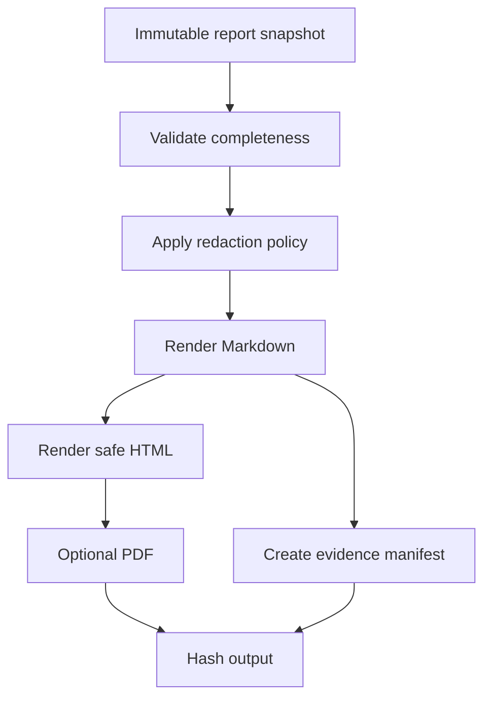

# Report Generator Specification

## Purpose

Generate consistent, redacted and reproducible Markdown, HTML and optional PDF
reports from canonical Finding Hub data. Markdown is the intermediate source of
record for report content.

## Report types

### Executive report

- Objective and business context.
- Scope and limitations.
- Overall risk narrative.
- Attack-path summary without operationally sensitive payloads.
- Priority findings and remediation themes.
- Positive controls and residual risk.

### Technical report

- Engagement metadata and methodology.
- Asset inventory and test coverage.
- Detailed finding records.
- Reproduction conditions with safe redaction.
- Evidence references and integrity digests.
- Root cause, mappings, remediation and verification guidance.

### Retest report

- Original finding and remediation reference.
- Candidate artifact/digest and environment.
- Exact original and added regression tests.
- New evidence and disposition.
- Reopened, verified and residual-risk items.

## Generation flow

## Reproducibility

Each report records:

- template version and source commit;
- query/snapshot identifier;
- engagement and scope hash;
- artifact digests under test;
- standards and mapping versions;
- redaction policy version;
- generation timestamp and generator version;
- output digest.

## Rendering safety

- Escape all imported text.
- Disable script execution and external resource loading.
- Do not embed untrusted HTML, SVG or data URLs.
- Rewrite evidence links to approved local manifest references.
- Enforce maximum section, table and image sizes.
- Use a restricted Markdown subset for user-authored text.

## Finding section contract

Every confirmed finding section includes:

1. ID, title, state and priority.
2. Affected assets and versions.
3. Description and root cause.
4. Preconditions and bounded reproduction.
5. Technical and business impact.
6. Evidence references.
7. CWE/OWASP/ASVS/WSTG/MASVS mappings.
8. CVSS vector and supporting risk signals.
9. Remediation with verification steps.
10. Retest status when available.

## Acceptance

- Same snapshot and template generate byte-stable Markdown after normalized time
  fields.
- Secret fixtures never appear in generated output.
- Broken/incomplete finding records fail validation with actionable messages.
- Generated internal links resolve.
- PDF visual checks are required if PDF export is implemented.

