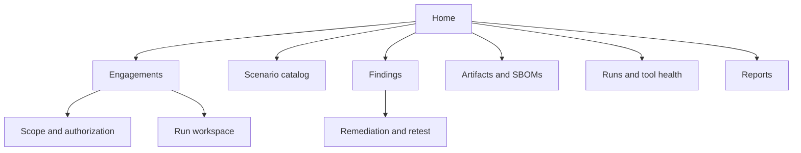

# UI/UX and Design System Specification

## UX goals

- Make scope and safety state visible at all times.
- Separate raw observations from confirmed findings.
- Explain why a gate or action is blocked.
- Support learning without exposing hints prematurely.
- Present risk without relying on color alone.
- Keep dangerous actions deliberate and reversible where possible.

## Information architecture

## Core screens

- Engagement list and creation wizard.
- Signed scope review and validation preview.
- Scenario catalog with standard filters.
- Run console with budget counters and kill switch.
- Finding queue and finding detail.
- Evidence viewer with redaction and integrity metadata.
- Remediation/retest comparison.
- Standards coverage matrix.
- Pipeline and release evidence dashboard.
- Report preview and export.

## Visual language

- Neutral canvas with high-contrast surfaces.
- Severity uses label, icon and text in addition to color.
- Insecure target context has a persistent patterned red boundary and the word
  `INSECURE LAB`.
- Secure target context uses a green boundary and the word `SECURE LAB`.
- Active tests use an amber indicator and show remaining safety budget.
- Cancel/kill actions remain reachable without scrolling.

## Design tokens

Define semantic tokens, not raw component colors:

- `surface.default`, `surface.elevated`, `surface.danger-lab`;
- `text.primary`, `text.muted`, `text.inverse`;
- `state.info`, `state.warning`, `state.danger`, `state.success`;
- `risk.p0` through `risk.p3` with icon and accessible label;
- spacing, typography, radius, border and motion tokens.

Support light, dark and increased-contrast themes. Respect reduced-motion
preferences.

## Component catalog

- Scope badge and target chip.
- Lab-context banner.
- Run state indicator and budget meter.
- Finding state badge and priority marker.
- Evidence card and redaction marker.
- Mapping chips with external reference links.
- Diff viewer for vulnerable/secure code and retest evidence.
- Policy-gate result card.
- Destructive-action confirmation dialog.
- Timeline/audit event list.

## Interaction requirements

- Starting an active profile requires scope summary and typed confirmation.
- A denied action explains the requirement or policy that failed.
- Hints reveal one level at a time and log learning progress, not security audit.
- Finding state transitions display prerequisites before submission.
- Evidence is never automatically copied to clipboard.
- External links display destination and open with safe browser attributes.

## Accessibility acceptance

- WCAG 2.2 AA automated checks plus manual keyboard review.
- Logical heading and landmark order.
- Visible focus and no keyboard traps.
- Live status updates are announced without excessive interruption.
- Charts have equivalent tables or text summaries.
- Minimum target sizes and error messages linked to fields.

