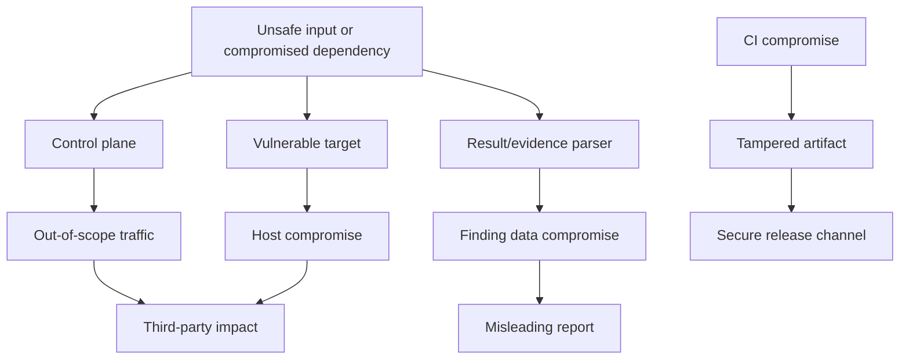

# Threat Model

## Scope

This threat model covers the control plane, target plane, scanner adapters,
Mobile harness, Finding Hub, evidence/reporting and CI/CD. It protects the owned
workstation and prevents the lab from affecting third parties.

## Security objectives

1. No active traffic leaves the authorized scope.
2. Vulnerable targets are never publicly reachable.
3. Untrusted tool output cannot compromise the control or finding planes.
4. Evidence and authorization records preserve confidentiality and integrity.
5. Insecure code cannot enter secure release artifacts.
6. Gate and risk decisions are attributable and reviewable.

## Assets

- Scope authorization and execution grants.
- Workstation and lab network.
- Tool registry and pinned images.
- Finding/evidence database.
- Signing keys and CI identity.
- Secure source and release artifacts.
- Mobile devices/emulators and installed profiles.
- Reports and risk decisions.

## Threat actors

- Accidental operator error.
- Defective or compromised scanner/tool image.
- Malicious lab input or seeded vulnerable application.
- Compromised dependency or CI action.
- Local unauthorized user.
- AI agent making an unsafe assumption or expanding scope.

## Primary attack paths

## STRIDE analysis

| ID | Category | Threat | Required mitigations |
| --- | --- | --- | --- |
| TM-S-001 | Spoofing | Forged execution grant | Signed short-lived grant, audience binding, nonce, replay cache |
| TM-S-002 | Spoofing | Tool impersonates approved adapter | Image digest allowlist and adapter identity handshake |
| TM-T-001 | Tampering | Scope changes after approval | Canonical serialization, hash/signature and immutable snapshot |
| TM-T-002 | Tampering | Evidence or report modified | Content digest, manifest, restricted writes and audit trail |
| TM-T-003 | Tampering | SARIF injects paths/markup | Schema, path containment, safe rendering and size limits |
| TM-R-001 | Repudiation | Privileged transition lacks actor | Authenticated actor, reason and append-only audit event |
| TM-I-001 | Disclosure | Tokens/secrets in logs/evidence | Structured redaction, allowlisted fields and secret scanning |
| TM-I-002 | Disclosure | Cross-tenant finding access | Server-side tenant/object authorization and tests |
| TM-D-001 | DoS | Scanner exhausts host/target | Request, CPU, memory, byte and duration budgets |
| TM-D-002 | DoS | Archive/result bomb | Streaming parser, decompression limits and quarantine |
| TM-E-001 | Elevation | Command injection in adapter | Typed fixed arguments, no shell and strict schemas |
| TM-E-002 | Elevation | Vulnerable target reaches Docker/host control | No socket mounts, non-root, dropped capabilities and network isolation |
| TM-E-003 | Elevation | CI action gains excessive rights | Pinned actions, minimal permissions, isolated jobs and OIDC |

## Misuse cases

### MU-001 External scan attempt

An operator or agent supplies a public hostname, alternate IP notation,
redirect, proxy target or rebinding domain. Scope Guard must reject every
effective destination and issue no packet.

### MU-002 Vulnerable target public exposure

A configuration maps a target to all interfaces. Startup and CI exposure checks
must fail, tear down the service and alert the operator.

### MU-003 Malicious result import

A tool result contains traversal paths, active HTML, oversized nested data or
external references. Ingestion quarantines or rejects it before rendering or
canonical storage.

### MU-004 Secure artifact contamination

A secure build imports an insecure module or fixture. Dependency fitness tests
and release policy fail before artifact promotion.

### MU-005 AI agent bypass

An agent encounters a failing security gate and attempts to disable or exclude
the test. Agent policy requires root-cause resolution or explicit expiring risk
acceptance; safety gates cannot receive exceptions.

## Security controls by boundary

| Boundary | Controls |
| --- | --- |
| User to control plane | Local authentication, CSRF protection, validation, authorization |
| Control to adapters | Execution grants, mTLS or isolated channel, fixed registry, budgets |
| Adapters to targets | Network allowlist, DNS pinning, rate limits, no ambient credentials |
| Tools to ingestion | Untrusted-input quarantine, schemas, content limits, receipts |
| Finding Hub to evidence | Content addressing, encryption, redaction and access policy |
| CI to release | Minimal permissions, immutable digest, SBOM, signature and provenance |

## Residual risks

- A vulnerability in the host container runtime can cross isolation.
- A dedicated Mobile device may retain platform data after an incomplete reset.
- Static and dynamic tools produce false positives and negatives.
- CVE/EPSS/KEV feeds may be delayed or incomplete.
- Human review and authorization remain necessary.

These risks must appear in the operator documentation and capstone report.

## Review triggers

Update this model when adding a tool, external service, public ingress, new
artifact parser, new privileged workflow, new evidence type or a changed Mobile
device model.

