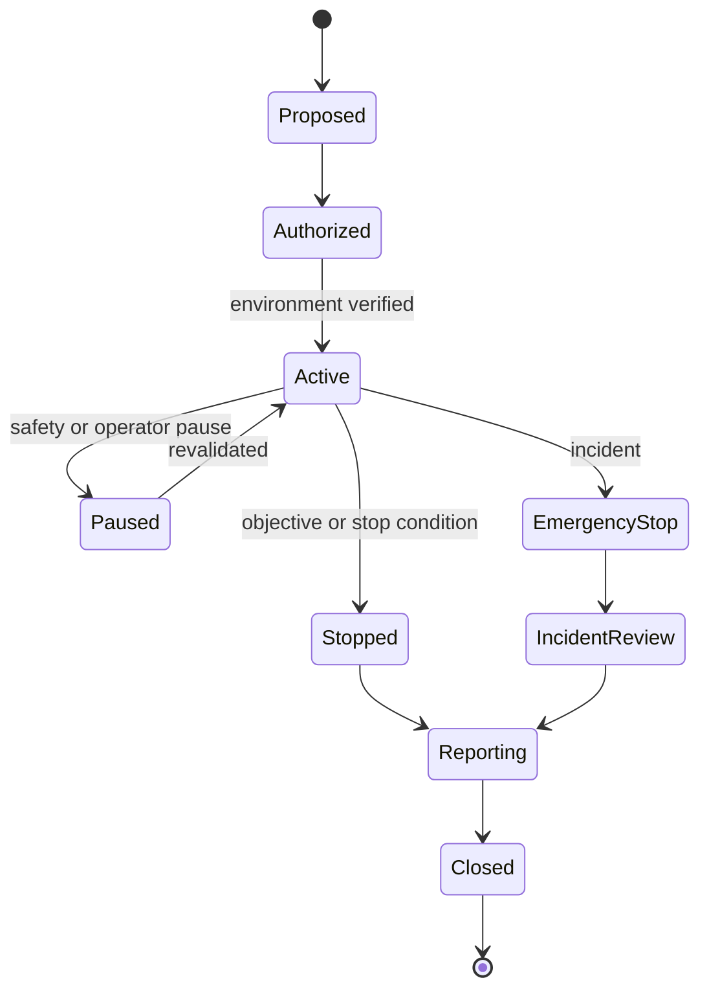

# Rules of Engagement

## Authorization rule

Testing is permitted only against assets owned by the operator or covered by
explicit written authorization. A scope record must exist before any active
test. Documentation, source review and offline static analysis may occur before
environment activation.

## Mandatory scope fields

- Engagement ID and purpose.
- Owner and approving authority.
- Valid start/end time and timezone.
- Exact applications, artifacts, hostnames, IPs, CIDRs, ports and API versions.
- Explicit exclusions.
- Permitted passive and active profiles.
- Maximum request rate, concurrency, duration, response bytes and test data.
- Allowed accounts and roles.
- Evidence and data-retention policy.
- Stop contacts and emergency procedure.
- Signature/approval and scope hash.

## Default prohibited actions

- Targets absent from scope.
- Public Internet scanning.
- Real-person phishing or credential collection.
- Destructive payloads or data deletion.
- Unbounded brute force, fuzzing or resource exhaustion.
- Persistence, stealth or evasion outside an explicit isolated exercise.
- Real customer, employee or production data.
- Exfiltration beyond a small synthetic canary.
- Publishing vulnerable artifacts or detailed live secrets.

## Proof-of-impact rules

- Stop after demonstrating the stated control failure.
- Prefer a seeded canary record over enumerating a dataset.
- Prefer a harmless marker over command execution with side effects.
- Use a mock metadata service for SSRF.
- Use bounded concurrent requests for race conditions.
- Do not test availability limits unless the scenario has a dedicated resource
  budget and disposable target.
- Record the smallest evidence that supports the conclusion.

## Engagement lifecycle

## Stop conditions

Immediately stop when:

- any destination is out of scope;
- the vulnerable lab is publicly reachable;
- real sensitive data is observed;
- instability exceeds the agreed budget;
- a target owner requests stop;
- kill switch, audit logging or redaction is unavailable;
- authorization expires;
- unexpected third-party infrastructure appears in the flow.

## Emergency response

1. Activate kill switch.
2. Block scanner and target network traffic.
3. Preserve bounded logs and environment metadata.
4. Notify the named stop contact.
5. Do not continue investigation outside the authorized boundary.
6. Follow the [exposure incident runbook](../09-operations/03-exposure-incident-runbook.md).

## Reporting obligations

- State exact scope, exclusions and limitations.
- Separate confirmed vulnerabilities, observations and tool-only results.
- Redact secrets and personal data.
- Include cleanup and retest status.
- Report any accidental boundary crossing immediately, not only in the final
  report.

