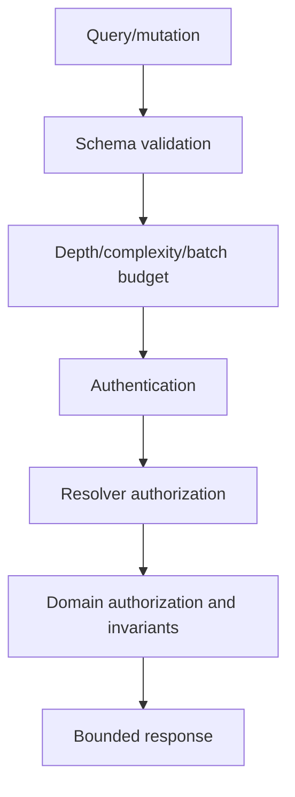

# API Security Test Catalog

## Coverage model

Test REST and GraphQL at transport, authentication, authorization, object,
property, workflow, resource and integration levels. An HTTP 2xx/4xx assertion
alone is insufficient; verify state and data ownership.

## Catalog

| Area | Tests | Expected control |
| --- | --- | --- |
| Inventory | Unknown versions, undocumented routes, debug schemas | Versioned inventory and removal tests |
| Authentication | Signature, issuer, audience, expiry, scope, replay, service identity | Strict token/service validation |
| BOLA | Replace every object identifier across identities/tenants | Object and tenant authorization |
| BFLA | Invoke every operation across roles | Method/action authorization |
| Property authorization | Read/write restricted fields and mass assignment | Explicit DTOs and response policy |
| Resource consumption | Pagination, body size, batch, depth, complexity, timeout | Server-enforced budgets |
| Sensitive flows | Repeated transfer, coupon, booking, notification or registration | Domain limits, idempotency and monitoring |
| SSRF | URL/webhook/import destinations | Registered endpoint and egress policy |
| Unsafe consumption | Invalid/untrusted upstream schema and redirects | Validation, timeout and safe output handling |
| GraphQL | Resolver auth, aliases, batching, fragments, introspection, error leak | Per-resolver policy and complexity budget |
| Webhooks | Signature, replay, destination validation and event ownership | Signed events, nonce/time and allowlist |
| Concurrency | Duplicate commands and out-of-order transitions | Idempotency and transactional state machine |

## Model-based authorization testing

Represent each test as:

`subject × tenant × action × object × state × expected decision`

Generate positive and negative cases from the model. Add a manual test when the
decision depends on business context not expressible in the matrix.

## Contract fuzzing boundaries

- Use the committed OpenAPI/schema as input.
- Limit examples, requests, depth, concurrency, duration and response bytes.
- Use synthetic accounts and disposable fixtures.
- Exclude destructive operations unless they have idempotent reset support.
- Persist the random seed for reproduction.
- Treat a crash, timeout or invariant violation as an observation requiring
  validation.

## GraphQL test flow

Tests must confirm every layer and prevent DataLoader/batch caches from crossing
authorization contexts.

## API finding evidence

Capture sanitized request/response pairs, identity/role labels, object owner,
expected policy, actual state change and artifact/API version. Do not retain raw
bearer tokens; replace them with stable labels.

