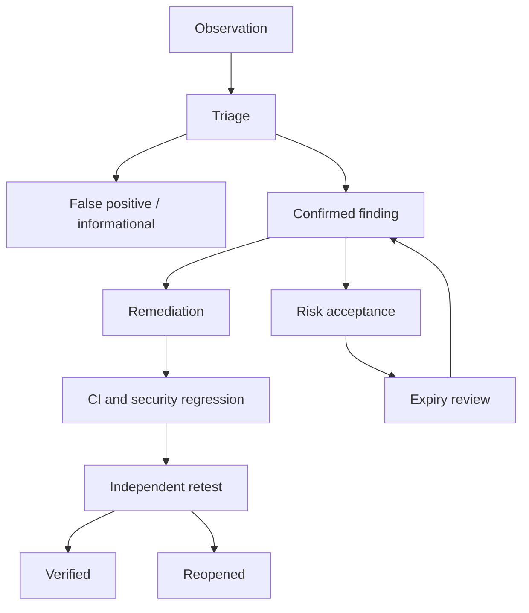

# Vulnerability Management and Risk Workflow

## Principles

- A scanner result starts as an observation.
- Confirmation requires reproducibility, root cause and impact.
- Severity, exploitation likelihood and business risk are separate.
- Remediation addresses root cause and recurrence.
- Exceptions expire and are reviewed.
- Closure requires independent retest evidence.

## Workflow

## Triage checklist

- Is the asset and version in scope?
- Is the result reproducible?
- Is the reported behavior actually a control failure?
- What preconditions and privileges are required?
- What is the smallest demonstrated impact?
- Is there a duplicate canonical finding?
- What is the primary root-cause CWE?
- Is tool confidence supported by manual evidence?

## Prioritization inputs

- Technical severity and CVSS v4 vector.
- Demonstrated exploitability and required preconditions.
- KEV/public exploitation and EPSS for associated CVEs.
- Reachability and attack surface.
- Asset, tenant and data criticality.
- Existing compensating controls.
- Detection and recovery capability.
- Confidence and business impact.

Never replace these inputs with one opaque score.

## Service-level targets for the lab

| Priority | Triage | Remediation plan | Retest |
| --- | --- | --- | --- |
| P0 | Immediate during active engagement | Same session | Immediately after candidate fix |
| P1 | One working day | Two working days | Next protected pipeline |
| P2 | Three working days | One learning sprint | Within sprint |
| P3 | Backlog review | Planned release | At completion |

These are training targets, not universal production SLAs.

## Risk acceptance

Must contain finding, owner, rationale, business context, compensating controls,
monitoring, expiry, review date and approval. Safety-boundary failures cannot be
risk-accepted for release.

## Metrics

- Time to triage and retest.
- False-positive rate by tool/rule.
- Reopened and recurrence rates.
- Findings without mappings or evidence.
- Expired exceptions.
- Age by priority and asset.
- Remediation theme/root-cause distribution.

