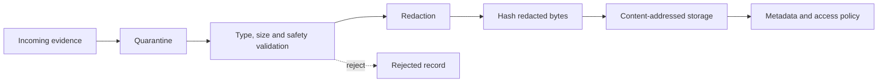

# Evidence, Privacy and Data Handling

## Evidence principles

- Collect the minimum evidence needed to support the conclusion.
- Use synthetic data and stable labels.
- Redact before canonical storage and report generation.
- Preserve integrity and provenance.
- Restrict access and retention by engagement.

## Allowed evidence

- Sanitized request/response pairs.
- Source location and relevant bounded code excerpt.
- Screenshots with synthetic data.
- Tool result subset and immutable raw-result reference.
- Logs with secrets removed.
- Artifact, SBOM, configuration and digest metadata.
- Test output and retest comparison.

## Forbidden evidence

- Real passwords, session tokens, private keys or signing material.
- Personal/customer data.
- Full database dumps.
- Unbounded memory, disk or packet captures.
- Unredacted environment files.
- Third-party source/data outside authorization.

## Redaction policy

Redact authorization headers, cookies, secrets, passwords, key material, reset
tokens, device identifiers and sensitive fields. Use stable placeholders such
as `[TOKEN-01]` so separate evidence items remain understandable without
retaining the value.

## Evidence ingestion

## Integrity manifest

An export manifest contains path/label, media type, size, SHA-256 digest,
engagement, evidence ID, redaction policy version and source relationship. It
does not contain signed URLs or storage credentials.

## Retention

- Active engagement: retain approved evidence.
- Closed engagement: default archive up to 30 days.
- Long-term portfolio: retain only deliberately sanitized report/evidence.
- Delete bytes after expiry; preserve authorized tombstone metadata.
- Backups follow the same retention intent and are included in deletion plans.

## Privacy review

Before adding a new evidence type, document purpose, fields, data subjects,
retention, access, redaction, export and deletion. Reject the type if a synthetic
fixture can achieve the learning objective without collecting real data.

