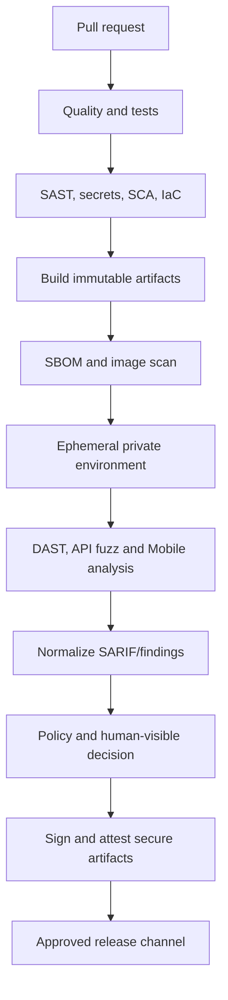
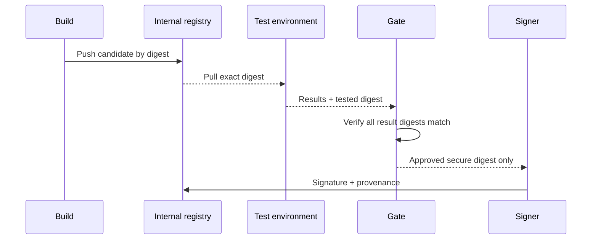

# CI/CD Architecture

## Objectives

- Fast feedback at pull request time.
- Deeper verification on protected branches and schedules.
- Dynamic tests against the exact immutable candidate.
- Progressive gates based on new verified risk, not raw scanner volume.
- Strong separation between insecure lab artifacts and secure releases.
- Complete SBOM, digest, signature, provenance and decision evidence.

## Pipeline topology

## Workflow classes

| Workflow | Trigger | Purpose | Active tests |
| --- | --- | --- | --- |
| PR | Pull request | Fast correctness and shift-left security | Passive/targeted only |
| Main | Merge to protected branch | Full build and integration | Bounded ephemeral |
| Nightly | Schedule/manual | Authenticated DAST, fuzzing, Mobile and deep scans | Yes, isolated lab |
| Release | Signed tag/manual approval | Verify exact secure artifacts and provenance | Bounded retest |

## Trust and permissions

- Default workflow token permissions are read-only.
- Jobs request only required permissions.
- Untrusted pull requests never receive secrets or signing identity.
- Third-party actions are pinned to immutable commits.
- Release uses protected environments and OIDC where external identity is
  required.
- Build and sign jobs are separated; signing consumes immutable digests.
- Scanner jobs cannot publish artifacts.

## Artifact flow

## Insecure artifact control

- Insecure artifacts use an internal lab-only namespace.
- They are short-lived and never signed with release identity.
- Policy rejects public registry destinations.
- A release manifest cannot reference an insecure module or artifact label.
- Protected CI tests validate these properties independent of repository input.

## Result handling

All tools produce machine-readable output. The consolidation job validates and
uploads results to Finding Hub. A top-level successful job does not imply every
result was accepted; per-tool receipts and ingestion errors are checked.

