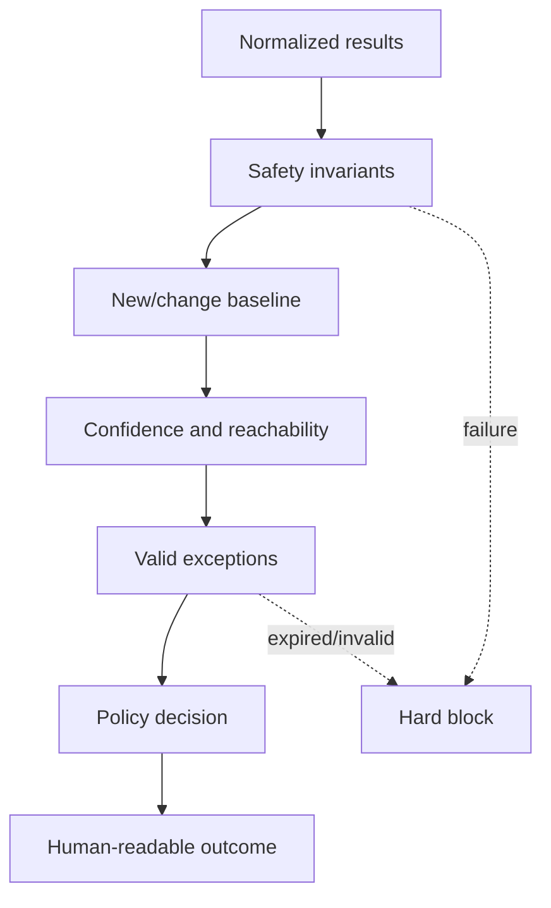

# Security and Quality Gates

## Gate philosophy

Gates protect defined outcomes. Raw severity from one tool is insufficient.
Policy evaluates newness, confidence, reachability, artifact type, risk
acceptance and mandatory safety invariants.

## Unconditional safety gates

These cannot be bypassed by ordinary risk acceptance:

- Vulnerable target has public ingress or unrestricted egress.
- Insecure artifact is selected for public/release publication.
- Scope Guard, kill switch, audit store or evidence redaction tests fail.
- Secure target imports insecure scenario code.
- Secret or private signing material appears in source/artifact/report.
- Tested, scanned, signed and published digests differ.
- Release has no SBOM, signature or provenance.

## Progressive gates

| Gate | PR | Main/nightly | Release |
| --- | --- | --- | --- |
| Tests/coverage | Block | Block | Block |
| New confirmed Critical/High | Block | Block | Block |
| New untriaged Critical | Block | Block | Block |
| Existing approved risk | Warn until expiry | Track | Block when expired |
| Medium findings | Review policy | Trend/root-cause | Block if release policy says |
| Tool warning | Visible | Must be triaged by deadline | No unresolved required-tool error |
| SCA reachability unknown | Warn/triage | Resolve for High/Critical | No unresolved Critical |

## Suppression requirements

Every suppression contains:

- exact rule/finding fingerprint and scope;
- technical justification;
- evidence supporting false-positive or accepted behavior;
- owner and reviewer;
- creation and expiry date;
- link to regression or compensating control.

Broad path or repository suppressions are prohibited unless generated code is
isolated and documented.

## Gate evaluation flow

## Required gate evidence

- Policy version and source commit.
- Inputs and normalized finding IDs.
- Candidate artifact digests.
- Decision, reasons and exceptions used.
- Actor/approval for protected release.
- Timestamp and environment.

