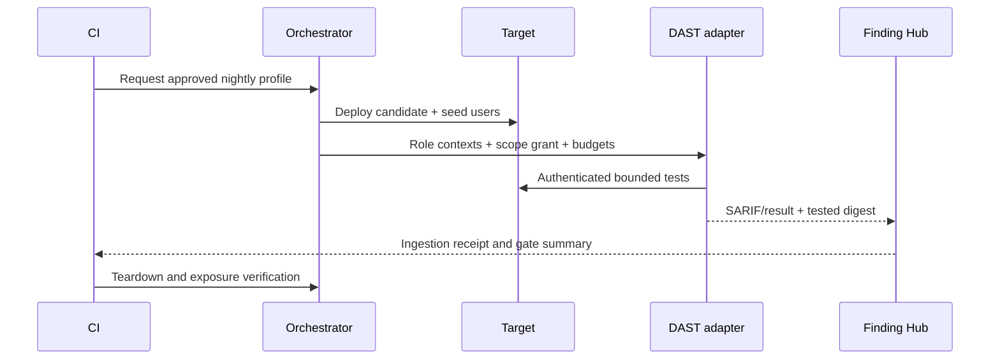

# Dynamic, API Fuzz and Mobile Pipeline Specification

## Preconditions

- Exact candidate artifacts deployed to private ephemeral environment.
- Health and public-exposure assertions pass.
- Synthetic accounts/fixtures are available.
- Scope document and active profile are validated.
- Result ingestion and kill switch are healthy.

## PR dynamic profile

- Browser smoke and authorization regression subset.
- Passive ZAP baseline against loopback/private target.
- Contract examples against API.
- No broad active crawling or fuzzing.

## Nightly dynamic profile

- Authenticated crawl for each representative role.
- Bounded ZAP active Web/API profile.
- API contract/property fuzz with persisted seed.
- Full authorization matrix.
- Business-state and bounded concurrency scenarios.
- Mobile static analysis and available emulator/simulator flows.

## Authenticated DAST design

Use synthetic accounts with least privilege and a separate role context per
scan. Authentication scripts retrieve fresh credentials from ephemeral fixture
service, never from repository secrets. Session material is redacted from logs
and destroyed during teardown.

## API fuzzing

- Generate from committed OpenAPI/GraphQL contract.
- Cap examples, depth, aliases, batch, body, response and duration.
- Persist seed and minimal failing example.
- Reset state or use idempotency for state-changing operations.
- A 5xx/crash is an observation until reproducible and triaged.

## Mobile pipeline

### Every candidate

- Build artifact and dependency inventory.
- Manifest/entitlement/permission diff.
- Signing and debug configuration checks.
- MobSF static analysis where artifact/platform support exists.
- Unit and component tests for secure storage, links and network policies.

### Scheduled/dedicated runners

- Install on clean emulator/simulator snapshot.
- Exercise login, logout, storage lifecycle, links and WebView flows.
- Route only lab traffic through approved proxy.
- Collect redacted logs/screenshots and revert device state.

## Failure and cleanup

If active verification fails or times out, stop adapters, preserve partial
evidence as incomplete, destroy ephemeral credentials, tear down targets,
verify ports closed and fail the required job. Do not treat no report as no
findings.

