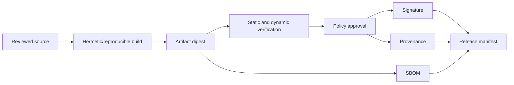

# SBOM, Signing and Provenance

## Required artifacts

For every secure releaseable application/service:

- application/container/Mobile artifact;
- SHA-256 digest;
- CycloneDX JSON or SPDX JSON SBOM;
- vulnerability/license scan result;
- signature bound to the digest;
- SLSA/in-toto-compatible provenance;
- build and gate evidence manifest.

Insecure lab artifacts receive an SBOM and digest for analysis but never a
production release signature.

## Build integrity flow

## SBOM requirements

- Include direct and transitive components where tooling supports them.
- Use package URLs and hashes where available.
- Identify application, base image and native Mobile components.
- Record generator/version and artifact digest.
- Validate schema and scan the SBOM itself.
- Do not treat a source-only SBOM as equivalent to final artifact inventory.

## Signing requirements

- Signing occurs after tests and policy approval.
- Sign the immutable digest, never a mutable tag.
- Prefer keyless OIDC signing in protected CI when available.
- Local development signatures are distinguishable and not trusted for release.
- Verification is automated before deployment or report claims.

## Provenance requirements

- Source repository and commit/tag.
- Builder identity and workflow definition.
- Build parameters that affect output.
- Resolved dependency/material references where supported.
- Produced artifact digests.
- No embedded secrets or unsafe environment dump.

## Verification policy

A release fails if:

- artifact digest differs from tested/scanned digest;
- SBOM is missing or invalid;
- signature identity or workflow is untrusted;
- provenance references unexpected source/materials;
- an insecure artifact label/module appears;
- required security gate evidence is absent.

