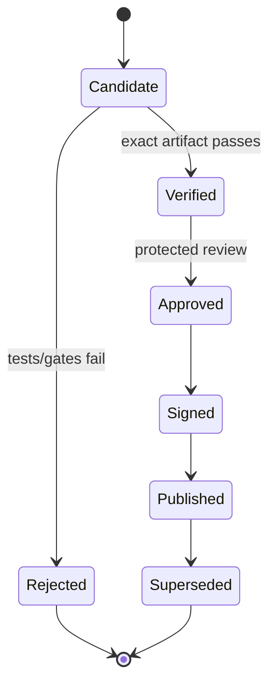

# Environments and Release Strategy

## Environment policy

| Environment | Mutable | Public ingress | Release identity | Data |
| --- | --- | --- | --- | --- |
| Developer local | Yes | Loopback only | No | Synthetic |
| PR ephemeral | Disposable | No | No | Synthetic |
| Main/nightly ephemeral | Disposable | No | No | Synthetic |
| Release verification | Disposable | No | Candidate-only | Synthetic |
| Secure release channel | Immutable artifacts | Not specified by lab | Yes | No runtime lab data |

Vulnerable targets have no public or persistent deployment environment.

## Configuration

- Use explicit schemas and typed configuration.
- Defaults are safe and local-only.
- Secrets enter at runtime from approved stores, never committed files.
- Environment-specific configuration cannot change safety invariants.
- Configuration hashes are included in run/build evidence.

## Release flow

## Versioning

- Use semantic versioning for product releases and stable scenario IDs.
- Contract breaking changes require major contract version.
- Scenario content may evolve without reusing identifiers; meaningful behavior
  changes increment scenario version.
- Reports record product, scenario, contract, tool and standards versions.

## Rollback

- Roll back by selecting a previously signed secure digest.
- Database migrations require a documented rollback or forward-fix strategy.
- Findings and evidence are never rolled back by deployment rollback.
- Re-run compatibility and security smoke tests after rollback.

## Promotion policy

Artifacts are promoted, not rebuilt. Convenience tags may change only through a
protected promotion process that references the immutable digest.

## Release evidence

- Source commit and release tag.
- Artifact/SBOM/signature/provenance digests.
- Test, coverage, scan and gate summaries.
- Open findings and valid risk acceptances.
- Approval identity and timestamp.
- Deployment/rollback notes.

