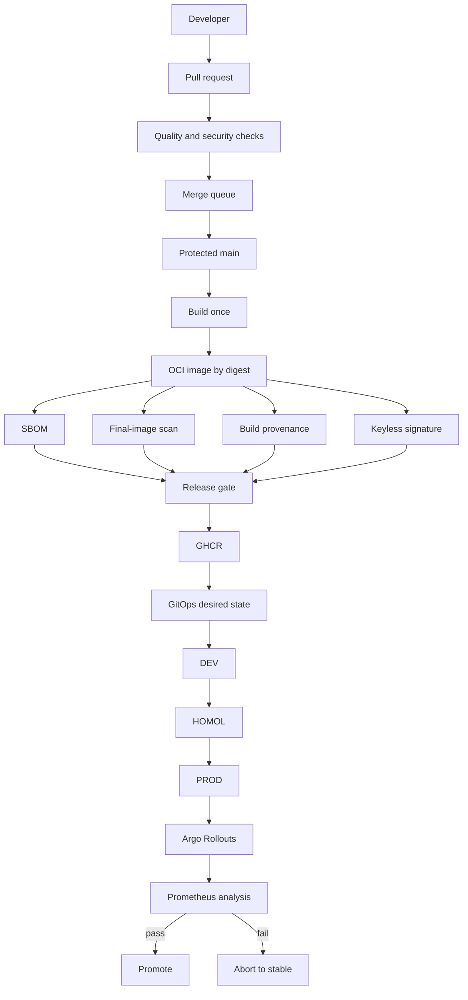

# Secure Delivery Operations

## Purpose

This document defines the operational model for the secure delivery platform. It complements the architectural CI/CD documents with concrete trust boundaries, promotion rules, rollout behavior and operator responsibilities.

## Target delivery topology



## Environment responsibilities

| Environment | Purpose | Artifact identity | Promotion rule |
| --- | --- | --- | --- |
| Local | developer feedback | source snapshot | never trusted for release |
| PR | untrusted change validation | PR commit | no publish/sign identity |
| Merge queue | candidate-main validation | merge-group commit | read-only token |
| DEV | first runtime validation | exact OCI digest | automatic after verified gate |
| HOMOL | production-like validation | same OCI digest | promote, never rebuild |
| PROD | controlled customer workload | same OCI digest | protected GitOps change |

A release artifact MUST NOT be rebuilt between DEV, HOMOL and PROD.

## Build and release sequence

```text
reviewed source commit
  -> clean release runner
  -> deterministic build
  -> OCI digest
  -> final image scan
  -> SBOM
  -> build provenance
  -> release-gate receipt
  -> keyless signature
  -> registry publication
  -> verification
  -> GitOps promotion
```

The release-gate receipt binds the release decision to the exact digest. A gate for one digest cannot authorize another digest.

## Pull request and merge queue boundary

Pull requests and `merge_group` runs are treated as unreleased code. Jobs on either trigger MUST NOT receive `packages: write`, `attestations: write`, `id-token: write` or any other writable release permission.

The repository workflow descriptor is authoritative. Generated YAML is checked against that descriptor to prevent hand-edited workflow drift.

## Progressive delivery

The provider-neutral rollout currently staged in PR #28 uses replica-based weights:

```text
25% -> analysis -> 50% -> analysis -> 75% -> analysis -> stable
```

Without a traffic router, Argo Rollouts approximates traffic using replica counts. Fine-grained `1%` or `5%` canaries MUST NOT be claimed until a supported traffic router such as NGINX, ALB or Istio is explicitly configured.

### Rollout analysis

At minimum, the staged baseline evaluates:

- HTTP 5xx behavior;
- p95 latency;
- repeated measurement windows;
- bounded failure tolerance.

Production thresholds MUST be calibrated to service-specific SLOs and traffic volume before the policy is enabled as an automatic production gate.

## Rollback semantics

A failed canary analysis aborts the new rollout and returns runtime traffic to the stable ReplicaSet. That is only the runtime half of rollback.

Git remains the desired-state source of truth. After an abort, the GitOps state MUST be restored to the last known-good digest or intentionally rolled forward.

```text
canary fails
  -> Argo Rollouts aborts
  -> stable ReplicaSet receives traffic
  -> operator/automation restores Git desired state
  -> Argo CD reconciles
  -> smoke/security verification runs
```

Destructive database and infrastructure changes are excluded from blind automatic rollback. They require backward-compatible migration design or a forward-fix plan.

## Last-known-good criteria

A digest can be called known-good only if:

- it was built from an identified source commit;
- required tests and security gates completed;
- the digest was verified after publication;
- required signature/provenance/SBOM evidence exists;
- it was successfully deployed in the target environment;
- no subsequent security quarantine invalidated it.

## Incident response is not ordinary rollback

A compromised artifact, signing identity or credential does not end with `rollback`.

```text
detect
  -> abort/freeze promotion
  -> restore known-good workload where safe
  -> quarantine affected digest
  -> revoke or rotate affected identity/credential
  -> preserve evidence
  -> determine blast radius
  -> rebuild the trust chain
  -> complete RCA
```

## GitHub governance prerequisite

Privileged delivery is not production-ready until repository governance is live. The repository currently reports no repository Rulesets and `main` is not protected.

Minimum governance before production publication:

- pull-request-only changes to `main`;
- required status checks;
- merge queue;
- CODEOWNERS review for workflow/security/infra paths;
- no force push or branch deletion;
- stale-review dismissal;
- break-glass bypass only;
- review/audit of privileged workflow changes.

## External references

- GitHub OIDC: https://docs.github.com/en/actions/reference/security/oidc
- GitHub artifact attestations: https://docs.github.com/en/actions/how-tos/secure-your-work/use-artifact-attestations/use-artifact-attestations
- GitHub Container registry: https://docs.github.com/en/packages/working-with-a-github-packages-registry/working-with-the-container-registry
- Argo Rollouts: https://argo-rollouts.readthedocs.io/en/stable/
- Kyverno ImageValidatingPolicy: https://kyverno.io/docs/policy-types/image-validating-policy/
