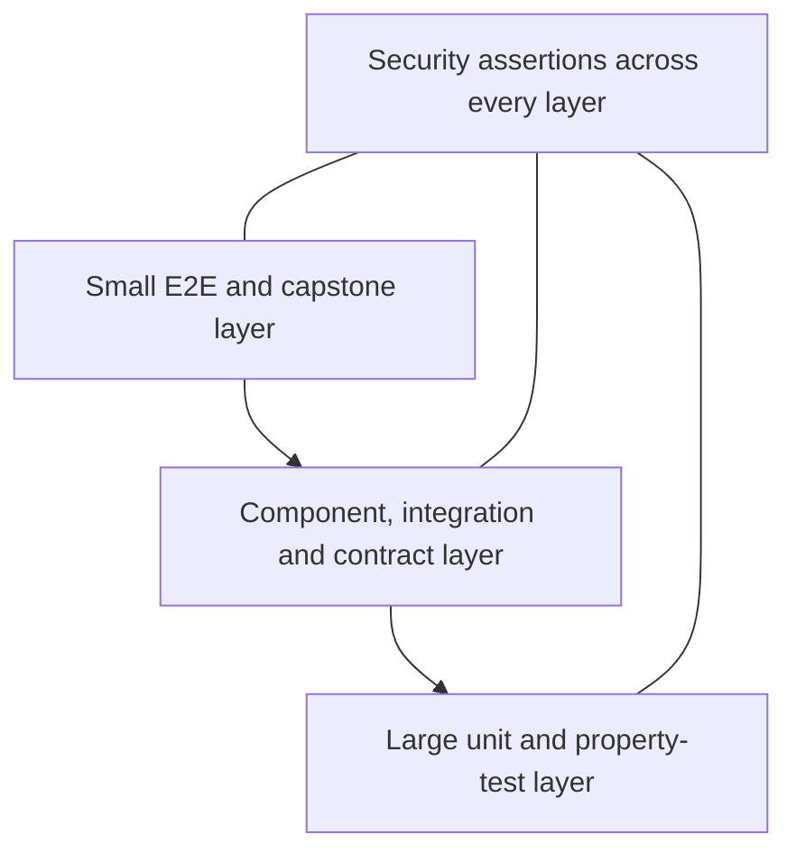
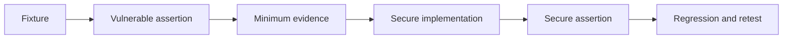

# Test Strategy

## Objectives

- Prove business correctness and safety invariants.
- Make every vulnerability scenario reproducible.
- Ensure fixes do not regress.
- Verify contracts and architecture across languages.
- Test failure, cleanup and rollback behavior.

## Test layers

The pyramid describes feedback economics, not a fixed test-count percentage.

## Test suites

| Suite | Scope | Runs |
| --- | --- | --- |
| Unit | Domain logic, parsers, policies, redaction, fingerprints | Every change |
| Property/model | State machines, path/URL normalization, authorization matrices | Every relevant change |
| Component | Service with real boundary substitutes | Every change |
| Integration | PostgreSQL, filesystem, adapters, HTTP contracts | PR/main |
| Contract | OpenAPI, GraphQL, JSON Schema and events | PR/main |
| E2E | Learner flows and secure/vulnerable comparisons | Main/nightly |
| Security regression | Original proof against fixed control | PR/main |
| Dynamic security | DAST, API fuzz, Mobile analysis | Targeted PR/nightly |
| Capstone | Complete engagement lifecycle | Release/capstone |
| Operations | Bootstrap, teardown, backup, restore, rollback | Main/scheduled |

## Core invariants

- Out-of-scope destination produces no tool process/network request.
- Vulnerable targets cannot bind publicly.
- Insecure code cannot enter secure artifacts.
- Missing scanner result cannot be reported as pass.
- Finding state transitions require their declared evidence/roles.
- Exact tested digest is signed and released.
- Secret fixtures never appear in logs/reports.
- Teardown leaves no reachable vulnerable service.

## Scenario test pattern

The vulnerable assertion must fail against the secure target; the secure
assertion must expose the weakness in the insecure target where applicable.

## Test independence

- Fixed/random seeds are recorded.
- Time and DNS are injectable.
- Tests own and clean their data.
- Parallel tests use isolated tenant/engagement IDs.
- No ordering dependency.
- External intelligence is stubbed except explicit contract/scheduled tests.

## Defect policy

A flaky security or safety test is a defect. It may be quarantined only with an
owner, reason, tracking issue, expiry and equivalent temporary protection.

