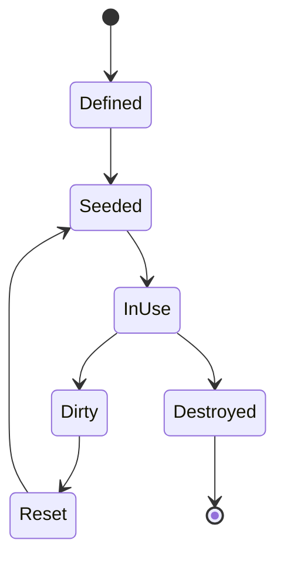

# Test Data and Fixtures

## Principles

- Synthetic only.
- Deterministic and resettable.
- Explicit tenant, role and ownership relationships.
- Small canaries prove impact without bulk data.
- Secrets look realistic enough to test redaction but are never valid elsewhere.

## Core fixture set

| Fixture | Purpose |
| --- | --- |
| Alpha/Beta tenants | Tenant-isolation testing |
| Alice/Bob customers | Horizontal access checks |
| Support/manager/admin roles | Function-level authorization |
| Canary order/account/document | Minimum proof-of-impact |
| Expired/valid/revoked tokens | Authentication lifecycle |
| Duplicate idempotency keys | Replay/concurrency behavior |
| Mock metadata service | SSRF without cloud access |
| Sandboxed marker directory | Path/process/upload scenarios |
| Secret-like strings | Redaction and secret scanning |
| Vulnerable package fixture | SCA teaching without production dependency |

## Fixture lifecycle

## Identity conventions

- Use reserved `.test` domains.
- Passwords/tokens are generated per reset and exposed only through a local
  fixture interface.
- Reports label identities by role, not secret values.
- No fixture resembles a real customer record or personal identifier.

## Files and archives

- Keep file fixtures small.
- Include safe examples for type mismatch, nested path and archive containment.
- Do not include executable malware or destructive scripts.
- Generate canary archives during tests when possible.
- Validate every extracted path remains under a disposable sandbox.

## Reproducibility

Store fixture version, random seed, clock instant and scenario ID with each run.
Reset must verify expected counts, ownership and digests before declaring ready.

