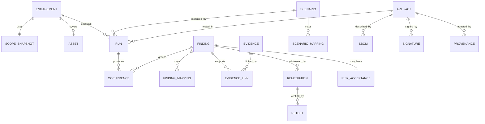

# Domain Model

## Aggregates

### Engagement

Owns purpose, scope snapshot, authorization, environment lifecycle and run
references. An engagement cannot become active without valid scope and verified
private environment.

### Run

Owns profile, adapter, execution grant reference, budgets, status, counters,
tested artifacts and result receipt. Run completion requires ingestion
acknowledgement.

### Finding

Owns canonical weakness identity, affected assets, state, risk signals,
occurrences, remediation, retest and risk acceptance. Raw tool records are
occurrences, not the finding aggregate itself.

### Evidence

Owns redacted content identity, provenance, classification, access and
retention. Evidence bytes are content-addressed outside the relational record.

### Scenario

Owns learning objective, mappings, vulnerable/secure targets, fixtures, proof
boundary, tests and version.

### Artifact

Owns digest, type, build/source reference, SBOM, scan, signature, provenance and
release status.

## Entity relationships

## Value objects

- `EngagementId`, `RunId`, `FindingId`, `EvidenceId`, `ScenarioId`.
- `CanonicalTarget`, `ScopeHash`, `ArtifactDigest`.
- `SafetyBudget`, `ExecutionGrantClaims`.
- `FindingFingerprint` with algorithm version.
- `CvssVector`, `PriorityDecision`, `Confidence`.
- `RetentionPolicy`, `RedactionPolicyVersion`.

## Core invariants

- Scope snapshot is immutable after engagement activation.
- A run target and adapter profile must exist in scope.
- A run cannot be completed without a valid receipt.
- A finding cannot be confirmed without required evidence/mapping fields.
- Verified requires a retest against a named candidate artifact/version.
- Risk acceptance has an owner and future expiry.
- Evidence digest identifies stored redacted bytes, not an unsafe original.
- Secure release references only signed, gated secure artifacts.

## Domain services

- Scope canonicalization and policy.
- Finding fingerprinting/deduplication.
- Priority decision support.
- Evidence redaction and safe preview.
- Report snapshot builder.
- Release manifest verifier.

