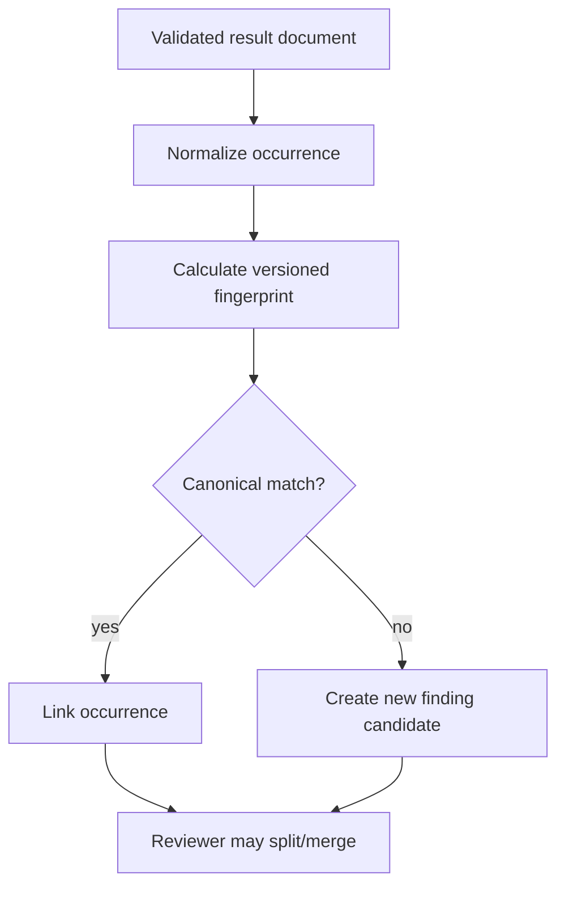

# SARIF and Canonical Finding Model

## Purpose

SARIF is an interchange format for supported tool results, not the complete
domain model. The Finding Hub stores raw SARIF immutably, normalizes occurrences
and manages canonical findings independently.

## Mapping

| SARIF concept | Canonical concept |
| --- | --- |
| `run` | Tool execution/run provenance |
| `tool.driver` | Adapter/tool identity and rule catalog |
| `result` | Occurrence/observation |
| `ruleId` | Source rule ID |
| `level` | Source severity signal, not final priority |
| `locations` | Normalized code/artifact/request location |
| `fingerprints` | Source fingerprint input |
| `taxa`/properties | CWE/standard mapping inputs |
| `fixes` | Suggested remediation input, never auto-applied |

## Required normalized occurrence fields

- occurrence ID and ingestion receipt;
- source run/tool/rule/version;
- asset and tested artifact digest;
- normalized location/operation/component;
- message and bounded context;
- source severity/confidence;
- source fingerprint and canonical-fingerprint inputs;
- mappings and references;
- raw result document digest;
- first/last observed time.

## Canonical finding fields

- stable ID and fingerprint algorithm version;
- title, description, root cause and impact;
- state, owner, confidence and priority decision;
- affected assets/components;
- occurrences;
- evidence links;
- CWE/OWASP/verification mappings;
- CVSS vector and independent risk signals;
- remediation, regression and retest;
- risk acceptance and audit timeline.

## Deduplication flow

## Ingestion security

- Limit document size and result count.
- Use streaming/defensive parser where possible.
- Reject external file/network references.
- Normalize repository paths and prevent traversal.
- Escape all text in UI/reports.
- Do not execute embedded fixes, scripts or snippets.
- Preserve raw document only in quarantined content-addressed storage.

## SARIF export

When exporting canonical findings to SARIF, include only safe normalized fields
and references. Do not embed evidence bytes, tokens or internal storage paths.

