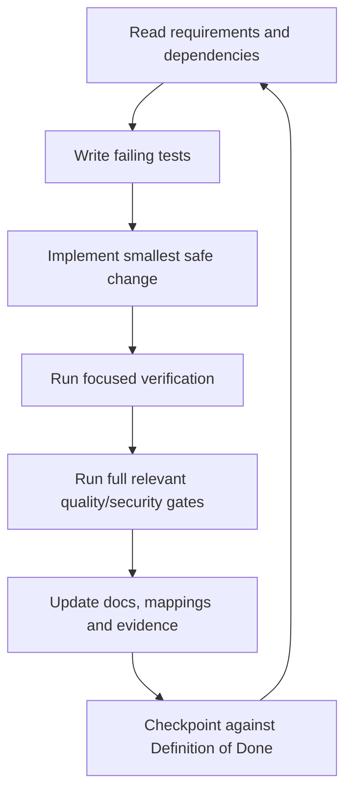

# AI Agent Operating Manual

## Mission

Build the specified Security Lab incrementally, safely and verifiably. The agent
is authorized to create and modify the implementation repository and run tests
against the local isolated lab. It is not authorized to target external systems,
obtain new credentials, weaken safety controls or publish vulnerable artifacts.

## Required reading

Before code changes, read the root README, scope/non-goals, Rules of Engagement,
system/container architecture, all accepted ADRs, current milestone and its
application/test specifications.

## Operating loop

## Rules

1. Work on one backlog task or coherent dependency group at a time.
2. Preserve requirement and scenario IDs.
3. Use TDD and maintain required coverage/mutation thresholds.
4. Prefer simple modular architecture and existing contracts.
5. Do not introduce a new service, datastore, framework or privileged tool
   without an ADR.
6. Do not disable, skip or broadly suppress a failing security/safety check.
7. Never use real secrets or personal data.
8. Never run a security tool without Scope Guard and an approved adapter.
9. Do not expose vulnerable services beyond loopback/private lab network.
10. Update implementation docs and diagrams when behavior/boundaries change.
11. Verify no unrelated user changes are overwritten.
12. Report blockers honestly; missing evidence is not a pass.

## Decision hierarchy

1. Legal/safety boundary and Rules of Engagement.
2. Accepted ADRs and architecture invariants.
3. Functional/non-functional requirements.
4. Application and API specifications.
5. Test and delivery requirements.
6. Backlog task wording.
7. Implementation convenience.

When two normative documents conflict, stop, describe the conflict with IDs and
request a decision or create a proposed ADR. Do not silently choose the less
restrictive interpretation.

## Mandatory stop conditions

Stop work and notify the operator when:

- a command/tool would target a non-private or unlisted destination;
- the task requires real credentials, public deployment or destructive testing;
- a vulnerable target is reachable publicly;
- a requested change weakens Scope Guard, kill switch, audit, redaction or
  insecure-publication protection;
- a permission, credential or external coordination not already configured is
  required;
- a protected safety test cannot pass without changing the specification;
- repository state contains overlapping unrelated changes that cannot be safely
  preserved.

## Change procedure

For each task:

1. Restate requirement IDs and acceptance tests in the task note.
2. Inspect affected contracts and modules.
3. Add failing tests.
4. Implement and refactor.
5. Run focused tests, then required module/integration/security gates.
6. Inspect diffs for secrets, unsafe scope changes and unrelated edits.
7. Update docs and task status.
8. Record commands, versions, artifacts and known limitations.

## Security scenario procedure

- Implement vulnerable behavior only in the insecure target/module.
- Add a persistent lab marker and public-exposure assertion.
- Limit proof to synthetic canary impact.
- Implement secure counterpart independently.
- Add regression test against secure target.
- Add scenario mappings and finding template entry.
- Confirm insecure target cannot enter release channel.

## Quality evidence in handoff

Every completed task reports changed files, tests executed, coverage/mutation
impact, security tools executed, generated artifacts/digests, documentation
updated and remaining risk. Do not claim a check that was not run.

