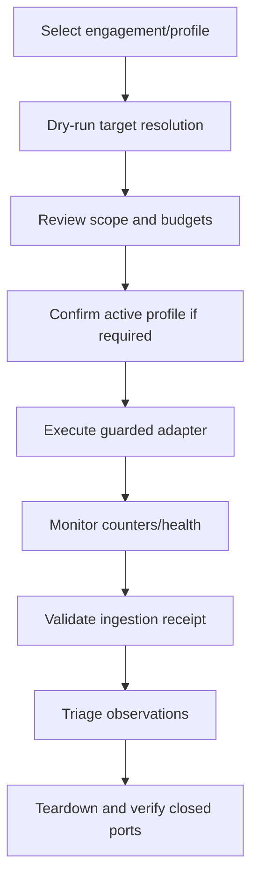

# Controlled Scan Runbook

## Preconditions

- Written/signed scope is active and unexpired.
- Target resolves entirely inside allowed ranges.
- Environment exposure check passes.
- Required fixtures and synthetic identities are ready.
- Adapter is registered and pinned.
- Ingestion, audit and kill switch are healthy.
- Operator reviewed passive/active classification and budgets.

## Procedure

## During execution

- Monitor requests, bytes, duration, errors and target health.
- Stop at proof boundary or objective completion.
- Do not expand paths/hosts based on discoveries without a new scope approval.
- Do not treat discovered credentials as permission to use them.
- Use kill switch for unexpected destination, real data or instability.

## Completion

- Adapter final status and output are present.
- Finding Hub issued a receipt for each required result.
- Tool errors are visible and do not become zero-finding passes.
- Synthetic sessions/credentials are revoked.
- Environment is reset/destroyed as planned.
- Findings are triaged separately from raw results.

## Cancellation

On cancel: stop new requests, terminate adapter within budget, preserve partial
result as incomplete, revoke grant, clean fixtures and verify network closure.

## Evidence checklist

- Scope hash and engagement ID.
- Adapter/tool version and image digest.
- Configuration hash and safety budgets.
- Target/artifact digest/version.
- Start/end status and counters.
- Ingestion receipts and redacted evidence IDs.
- Cleanup/exposure assertion.

