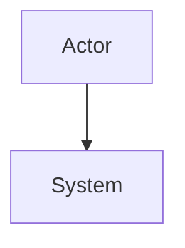

# Threat Model: `<System/Change>`

## Metadata

- Owner:
- Reviewers:
- Version/date:
- Related requirements/ADRs:
- Review trigger:

## Scope and assumptions

## Assets and security objectives

| Asset | Confidentiality | Integrity | Availability | Owner |
| --- | --- | --- | --- | --- |
| | | | | |

## Architecture and trust boundaries

## Data flows

## Threat actors and misuse cases

## STRIDE analysis

| ID | Category | Threat | Preconditions | Impact | Controls | Verification | Residual risk |
| --- | --- | --- | --- | --- | --- | --- | --- |
| | | | | | | | |

## Privacy analysis

- Data collected/purpose:
- Minimization:
- Retention/deletion:
- Access/export:

## Residual risks and decisions

## Required security tests

## Review and sign-off

